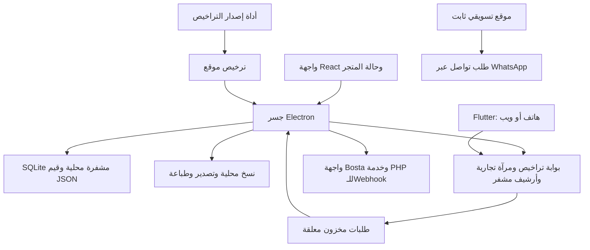

# تقرير تدقيق PartFlow الشامل — 15 سبتمبر 2026

مرجع التنفيذ: الملفات المحلية خلال 14–15 سبتمبر 2026. تجميع هذه النسخة: 2026-09-15T08:16:55.957Z.

فهرس التقرير:

- [الملخص التنفيذي](#audit-section-1)
- [منهج القراءة وحدود الدقة](#audit-section-2)
- [البنية وانتقال البيانات — كود](#audit-section-3)
- [مكونات خارج جدول مفاتيح المميزات](#audit-section-4)
- [معنى الاستيعاب والحدود الصريحة](#audit-section-5)
- [دلالة الاختبارات وحدود المحاكاة](#audit-section-6)
- [ملاحظات أمان وتشغيل تحتاج فهمًا صحيحًا](#audit-section-7)
- [مطابقة التوثيق والتسويق مع التنفيذ](#audit-section-8)
- [ما بقي غير متحقق منه](#audit-section-9)
- [هوية النسخة والجهاز وحجم المصدر](#audit-section-10)
- [حصر المميزات وحالة كل منها](#audit-section-11)
- [نتائج التحقق لكل مكون](#audit-section-12)
- [الأحمال المتدرجة: الأعداد الفعلية](#audit-section-13)
- [المشكلات مرتبة حسب الأولوية](#audit-section-14)
- [تقييم VPS الذي عرضه صاحب المشروع — مصادر رسمية واستنتاج مشروط](#audit-section-15)
- [الاعتماديات والتنبيهات الخارجية](#audit-section-16)
- [ملحق المسارات: الوجود والحراسة والملاحظة التشغيلية](#audit-section-17)
- [ملحق الاختبارات: ملفات Vitest المنفذة](#audit-section-18)
- [إعادة التحقق وفهرس الأدلة](#audit-section-19)

## الملخص التنفيذي

**المنظومة واسعة وظيفيًا، لكن النسخة المحلية الحالية لا تستحق وصف «مستقرة بلا تحفظ».** تشمل إدارة القطع والبيع والشراء والحسابات والفروع والموظفين والشحن والتراخيص وFlutter وخدمات سحابية مساندة. حُصرت 44 ميزة تعاقدية، و66 تعريف مسار و64 ملف صفحة في سطح المكتب؛ هذه أعداد تنظيم الكود، وليست 44 وظيفة اختُبرت كلها من البداية للنهاية.

أهم نتيجة هي فقد سجل حركة المخزون في تجربة إغلاق طبيعي، مع بقاء الفواتير، ونتيجة مستقلة أعادت أرصدة فرعين إلى الفرع الرئيسي. وأكد الإنهاء القسري قبل استقرار الحفظ فقد آخر فاتورة وقيدها النقدي مع بقاء حركة خصم المخزون. توجد أيضًا مشكلة تكرار أثر طلب الهاتف عند فشل التأكيد، وثغرة في فرض صلاحيات الكتابة عند جسر التخزين. لهذا **لا أوصي باعتماد هذه اللقطة للعمل التجاري قبل معالجة عيوب سلامة البيانات وإعادة اختبارها**؛ هذا حكم على الأدلة المحلية، وليس حكمًا على كل إصدار منشور سابق.

نجح البيع الفعلي بعينات متكررة على الأحجام الصغير والمتوسط والكبير، ونجحت فحوص وظيفية كثيرة؛ لكن الكبر زاد زمن الدخول والبيع وأظهر تعليق صفحة المستحقات. الحجم الممتد تولّد واجتاز المدقق الحسابي بعد تكييف أداة القراءة، ثم تعذر إعداد قاعدة Electron بسبب حد طول النص في بيئة الأداة. لا توجد نتيجة تشغيل تثبت استيعاب 180 ألف فاتورة.

فحص الأنواع وLint في سطح المكتب غير ناجحين، وبعض اختبارات الواجهات تحتاج تحديثًا. Flutter اجتاز التحليل وبناء Web مع حالتين فاشلتين في الاختبارات. البوابة اجتازت 49/49 اختبارًا قياسيًا في نسخة مصدر مطابقة على Node 22 بعد إصلاح مسار نسخة الاختبار، واجتازت 15 جولة ضغط حتى تزامن 50. تعطل المشغل الأصلي على Node 24 داخل إضافة أصلية؛ اختلاف البيئة جزء من النتيجة. PHP والخدمات الحية والأجهزة الطرفية غير مختبرة. التفاصيل التالية تميز هذه الحالات بدل جمعها في نسبة نجاح مضللة.

اكتملت مدة عمليات الساعة بـ60 بيعًا، لكن المقارنة الدلالية داخل العرض تعذرت مع توقف عملية العرض. الفحص المستقل أثبت بقاء 60 فاتورة جديدة قبل إعادة الدخول؛ بعد الدخول والإغلاق كانت نتيجة المطابقة `restart-with-differences`. لا تُعرض هذه الساعة كنجاح استقرار أو ضمان لسلامة البيانات.

## منهج القراءة وحدود الدقة

المراجعة تخص الملفات المحلية وقت التنفيذ في 14 و15 سبتمبر 2026، بما فيها تعديلات العمل غير المودعة في Git. لا تمثل نسخة Git وحدها، ولا تثبت أن المثبت القديم أو الموقع المنشور يحتويان الكود نفسه. لا يمكن منح ضمان بأن مراجعة برمجية اكتشفت كل خطأ ممكن؛ التزام هذا التقرير هو ربط النتائج بالدليل، وتجنب تحويل ما لم يُختبر إلى حقيقة.

تصنيف الادعاءات المستخدم في التقرير:

- **كود:** موجود في المصدر المشار إليه، ولم يلزم أن ينجح من البداية للنهاية.
- **تشغيل:** نتيجة تجربة محفوظة، بالمدخلات والبيئة وحدود المحاكاة المحددة.
- **استنتاج:** تفسير للأدلة، ويُذكر أساسه؛ ليس قياسًا إضافيًا.
- **غير متحقق:** لم يُشغّل أو لم تتوفر شروط إثباته. غياب اختبار لا يثبت غياب الميزة، ووجود شاشة لا يثبت اكتمالها.

أوامر التحقق لم تتضمن إصلاح المنتج أو النشر. أُنشئت قواعد صناعية ومفاتيح تراخيص مؤقتة، واستُخدم localhost للبوابة، وعُزل ملف مستخدم Electron. يمنع غلاف تشغيل التدقيق طلبات HTTP الخارجية من Electron والواجهة. اختبارات الاعتماديات تقرأ سجل npm، وبناء الأدوات قد يحتاج تنزيل مكونات؛ هذه ليست اختبارات للخدمات التجارية الحية. التقارير السابقة وتعليقات الكود التاريخية ليست مصدرًا للأزمنة الحالية.

## البنية وانتقال البيانات — كود

سطح المكتب هو تطبيق React داخل Electron. الواجهة تستخدم Contexts ومصفوفات JavaScript لحالة المتجر، ويجمع `AppContext.tsx` قدرًا كبيرًا من العمليات التجارية. جسر `preload.cjs` يعرض وظائف محددة إلى الواجهة، ويستقبلها `main.cjs` عبر IPC. قاعدة سطح المكتب جدول `kv_store` يحفظ قيم JSON؛ تستخدم مكتبة SQLite المشفرة وWAL. هذه ليست جداول SQL علائقية مستقلة لكل فاتورة وبند وصنف.

التقطيع في التخزين يستخدم مجموعات من 500 سجل للفواتير والمخزون والعملاء والمنتجات ومجموعات أخرى. يفيد في حجم الكتابة ونقل السجل، لكنه لا يحول البحث والتقارير تلقائيًا إلى استعلامات SQL مفهرسة. سجل الحركات محمّل عند الحاجة؛ أما كثير من الفواتير والعملاء والمنتجات فيدخل ذاكرة الواجهة. `storage:get-batch` يقرأ الصفوف من القاعدة ثم يستبعد قطع سجل الحركات من الإرسال الأول. دليل البنية: [التخزين](../src/lib/storage.ts)، [معالجة IPC](../electron/main.cjs)، [المتجر](../src/store/AppContext.tsx).

البوابة مختلفة: خادم HTTP في Node.js مع جداول SQLite للعملاء والتراخيص والجلسات والأجهزة والإحالات والمرآة التجارية والطلبات. المرآة التجارية تشمل بيانات منتقاة للقراءة في Flutter؛ الأرشيف السحابي الكامل مسار مستقل مشفر بكلمة مرور. لا يصح اعتبار وجود المرآة نسخة احتياطية كاملة، أو اعتبارها نظام POS موزعًا بين عدة أجهزة سطح مكتب.

**تشفير المرآة — كود وتشغيل:** فتح ملف قاعدة البوابة الصناعية بالمكتبة العادية دون مفتاح تشفير أعاد 1000 صنف و2000 عميل و4991 طلبًا؛ ترويسة الملف SQLite format 3. بيانات المرآة لا تستخدم تشفير قاعدة التطبيق المستخدم في Electron. هذا لا يثبت غياب تشفير قرص الـVPS لدى المزود أو النظام، ولا يخص فك الغلاف المشفر للأرشيف. يلزم حماية ملف البوابة ونسخه على مستوى الخادم، ولا يُسوَّق الأرشيف المشفر كدليل تشفير لكل مخزن بيانات في المنظومة. [الفحص](../reports/system-audit-2026-09-14/portal-at-rest-check.json)، [فتح القاعدة](../../autoparts-license-portal/src/db/index.js:103).

الفروع داخل سطح المكتب لها تعريفات وأرصدة وتحويلات في القاعدة المحلية. لم تُثبت هذه المراجعة مزامنة متزامنة آمنة لعدة برامج سطح مكتب تكتب في المخزون نفسه. عدد الفروع المرخص، وعدد حسابات الموظفين، وعدد الأجهزة المرتبطة بالموبايل، وعدد طلبات الخادم المتزامنة مقاييس مختلفة.

## مكونات خارج جدول مفاتيح المميزات

| المكوّن/الوظيفة | التنفيذ الذي تمت مراجعته | حدود الإثبات |
|---|---|---|
| الدخول وإعداد أول تشغيل | إنشاء مالك، كلمة مرور Argon2 في Electron، جلسات وصلاحيات وقفل محاولات | اختبارات Electron نجحت في الإعداد والدخول والقفل؛ مفتاح التراخيص الحقيقي متجاوز في HW_E2E |
| الموظف مقابل المستخدم | حساب دخول له صلاحيات؛ وموظف بدون حساب له مرتب ومعاملات | لا يُحسب كل موظف مخزن كجلسة متزامنة |
| الفروع | ترخيص توسعة فرع، تعريف الفروع، تحويل وخصم وإضافة أرصدة | الأرصدة تحتاج معالجة خلل إعادة التهيئة الموضح في المشكلات |
| الطباعة وPDF | مسارات طباعة وفواتير وكشوف ونافذة تصدير داخلية | الطابعة الحرارية ودرج النقدية والطابعات الفعلية غير مختبرة |
| التحديثات | electron-updater، فحص دوري وحالة تنزيل وتطبيق، واستحقاق ضمان التحديث | لا تجربة تحديث مثبت إنتاجي فوق إصدار قديم ولا rollback ميداني |
| بوابة الإدارة | عملاء، تراخيص وتجديد وترقية وإلغاء، إحالات وعمولات، جلسات، أجهزة وإشعارات، مرآة وأرشيف | تحقق محلي واختبارات محددة؛ واجهة الإدارة كلها ليست مغطاة باختبار متصفح شامل |
| أداة إصدار التراخيص | توليد مفاتيح وتوقيع ترخيص وربطه بالجهاز وباقة ومزايا وفروع | فحص parity وself-test بمفتاح مؤقت؛ لا تعديل أو استعمال لمفتاح التوقيع الإنتاجي |
| Flutter | دخول وربط جهاز وTOTP، لوحة وأصناف وعملاء وطلبات وتفاصيل وتحليلات وإحالات، ماسح وطلبات مخزون، إشعارات وبصمة | analyze واختبارات وبناء Web؛ لا اختبار فعلي لـiOS أو Android أو الكاميرا أو البصمة أو استقبال push |
| Bosta PHP | استقبال وحفظ حدث، قراءة الأحداث المعلقة وتأكيدها، سر webhook ورمز polling منفصلان | مراجعة مصدر فقط؛ PHP وMySQL لم يتوفرا للتشغيل، ومحرك Docker غير متاح |
| الموقع | Next.js مع output: export وimages.unoptimized، صفحات مزايا وباقات وضمان وتوافق وتواصل وخصوصية | lint ناجح، والبناء نجح في نسخة معزولة بمعتمديات Windows بعد تعذر بيئة SWC الأصلية؛ لا اختبار نشر حي أو إرسال طلب للعميل |

خدمة PHP تفرض HTTPS بحسب متغيرات الخادم/ترويسة الوكيل، وتستخدم `hash_equals` وPDO prepared statements، وتحد جسم الطلب إلى 65,536 بايت، والقراءة/التأكيد إلى 100 حدث، وتحذف أحداثًا أقدم من 45 يومًا عند الاستقبال. مفتاح الحدث مشتق من هوية الشحنة والحالة والتوقيت. هذه حدود **كود**؛ لم يُختبر تكرار حدث حي أو تعطل MySQL أو ضبط الوكيل. [مصدر الخدمة](../services/bosta-webhook-hostinger/index.php).

**عزل خدمة الشحن — حد بنية مثبت من المصدر:** نسخة PHP تستخدم زوج أسرار واحدًا من config.php، وجدول أحداث بلا shop_id/customer_id، وقراءة المعلّق وتأكيده غير مقيدتين بمعرّف محل. لا يُعتبر نشر هذه النسخة مرة واحدة وإعطاء رمز polling نفسه لمحلات مستقلة عزلًا بينها. يمكن تخصيص نسخة وإعدادات وقاعدة منفصلة لكل محل، أو بناء مسار متعدد المحلات يربط كل سر بالأحداث المملوكة له. هذا لا يثبت وجود نشر مشترك مكشوف حاليًا، ولا ينفي عزل بوابة Node المنفصلة. [القراءة والتأكيد](../services/bosta-webhook-hostinger/index.php:198)، [المخطط](../services/bosta-webhook-hostinger/schema.sql).

## معنى الاستيعاب والحدود الصريحة

| البعد | ما يسمح به الاستنتاج من الكود | ما لا يمكن استنتاجه |
|---|---|---|
| عدد السجلات المحلية | لا يظهر سقف تجاري عام ثابت لكل مصفوفة؛ الذاكرة والتسلسل والواجهة عوامل حاكمة | لا يوجد دليل على «عدد لا نهائي» أو حد أقصى آمن موحد |
| مرآة البوابة | products حتى 100,000، customers حتى 100,000، orders حتى 250,000، وبنود الفاتورة حتى 500 | هذه حدود قبول payload، وليست نتائج أداء عند بلوغها |
| حجم مزامنة المرآة | 25,000,000 بايت على السلك، وحد فك الضغط 96,000,000 بايت | ليست أحجام قاعدة SQLite المسموحة ولا ضمان مزامنة كل متجر ضمن عدد السجلات |
| الأرشيف السحابي | سقف الغلاف المشفر 48 MiB؛ مسار الاستقبال يسمح أيضًا بهامش wrapper | ليس حد حجم البيانات الأصلية؛ الضغط ومحتوى البيانات يغيران الحجم النهائي |
| ترقيم صفحات الموبايل | pageSize حتى 100 في المرآة | لا يُنقل كل تاريخ المحل في كل صفحة، لكن بعض تجميعات dashboard تفحص نطاقات أكبر |
| طلبات مخزون الهاتف | حتى 500 طلب معلق لكل محل؛ حد مقدار الطلب 100,000 وحدة ممثلة بالألف | لا يضمن تنفيذ الطلب مرة واحدة عبر فشل تأكيد سطح المكتب |
| سجل النشاط | إضافة logAudit تحتفظ بآخر 1000 سجل | ليس سجل تدقيق كاملًا لكل سنوات العمل |
| التزامن | محدد قراءة المرآة 180/دقيقة لكل IP؛ مزامنة 12/دقيقة لكل IP؛ محددات أخرى للمسح والربط | 50 طلبًا متزامنًا لا تعني 50 كاشيرًا أو 50 متجرًا يعملون بلا رفض |

المراجع: [commerce.js](../../autoparts-license-portal/src/lib/commerce.js)، [مسارات commerce](../../autoparts-license-portal/src/routes/commerce.js)، [stockOps.js](../../autoparts-license-portal/src/lib/stockOps.js)، [cloudState.js](../../autoparts-license-portal/src/lib/cloudState.js)، [المحدد](../../autoparts-license-portal/src/lib/rateLimit.js). محددات المعدل في ذاكرة العملية؛ لم يُختبر تشغيل عدة نسخ من الخادم خلف موزع أحمال.

دورية مرآة سطح المكتب دقيقتان، ودورية الأرشيف الكامل نصف ساعة في المصدر. إرسال طلب مخزون لا يعني تطبيقه فورًا، خصوصًا إذا كان سطح المكتب مغلقًا أو غير متصل. بيانات آخر نجاح في Flutter لا تجعل كل وظائف الهاتف تعمل بلا إنترنت. وظائف Bosta والإرسال الخارجي والتحديث والنسخ السحابي تحتاج الاتصال والخدمة المقابلة.

**ذاكرة النسخ الكبيرة — كود واستنتاج:** تصدير الحالة وتشفير النسخ يبنيان نصوص JSON وBuffers كاملة؛ ليست معالجة تدفقية لقاعدة كبيرة. دالة gunzip المحلية في backup-crypto تستخدم gunzipSync ثم toString بلا maxOutputLength صريح، بخلاف سقف فك ضغط جسم المرآة في البوابة. غلاف صغير مضغوط لا يحدد وحده مقدار الذاكرة بعد فك الضغط؛ مصادقة GCM تُفحص قبل فك الضغط لكنها لا تضع سقفًا لحجم ناتج ملف صحيح التشفير. يُوصى بحد معلن للناتج وبالتحقق من بنية النسخة قبل الاستيراد، مع اختبار آمن للحد. هذا **استنتاج مخاطرة موارد عند الاستعادة المحلية**، وليس انهيارًا ثبت بالتشغيل أو حدًا أقصى مثبتًا للسجلات؛ لم تُشغل قنبلة ضغط أو ملف يستنفد ذاكرة الجهاز. [الدالة](../electron/backup-crypto.cjs:45)، [سقف طلب البوابة](../../autoparts-license-portal/src/lib/http.js:89).

فحص حالة الترخيص على الإنترنت دوري كل 30 ثانية عندما يكون عنوان heartbeat مضبوطًا؛ فشل الشبكة يترك التحقق المحلي من التوقيع كما هو، بينما حالة حظر سبق استلامها تُخزن محليًا. لذلك لا يوجد إثبات لإلغاء فوري لجهاز غير متصل. [مسار الفحص](../electron/main.cjs:2156). لم تُختبر كل تغييرات بصمة العتاد أو تغيير ساعة النظام ميدانيًا.

في مسار ربط الهاتف، رمز التفعيل صالح عشر دقائق. إصدار جلسة جديدة لجهاز معروف يلغي رموزه النشطة السابقة؛ العمر الأقصى لرمز الوصول سنة أو نهاية الاشتراك إن كانت أقرب. دالة `deviceLimits` تفحص استحقاق الموبايل وMFA ولا تمثل حدًا عدديًا للأجهزة. لم يُستخرج من المسار الذي روجع سقف عددي مضمون لجميع الأجهزة والحسابات، ولم يُجر اختبار أجهزة فعلية متزامنة. [mobileAuth.js](../../autoparts-license-portal/src/lib/mobileAuth.js:253).

**فرق مهم بين السيريال وجلسة الجهاز — كود وتشغيل محلي:** دالة licenseForToken تقبل APLIC المطابق لسجل ترخيص نشط، وتقبل PFAT المطابق لتجزئة جلسة نشطة. مسار APLIC لا يطلب تحدي MFA أو هوية جهاز عند كل قراءة للمرآة؛ مسار PFAT يحدث last_used_at ويحدث last_seen_at عندما ترتبط الجلسة بجهاز. حمل البوابة هنا استعمل APLIC صالحًا بمفتاح صناعي ولم يُنشئ جلسة هاتف PFAT، ونجحت قراءات المرآة. لذلك لا يثبت الحمل وحده حماية الاقتران أو تكلفة تسجيل نشاط PFAT. كذلك إبطال جلسة PFAT لجهاز لا يعني إبطال سيريال APLIC للمالك؛ يجب معاملته كاعتماد وصول حساس، وعدم تسليمه بوصفه «مفتاح منتج عام» إذا كانت هذه القراءة متاحة. لم يُختبر سيريال عميل حقيقي أو تسريب أو وصول خارج localhost. [التحقق](../../autoparts-license-portal/src/lib/referrals.js:476)، [اعتماد الحمل](../reports/system-audit-2026-09-14/portal-load-child-node22.cjs).

## دلالة الاختبارات وحدود المحاكاة

| السيناريو الحرج | ما جرى فعليًا | حد الاستنتاج |
|---|---|---|
| بيع نقدي وتغير المخزون والنقدية | POS فعلي في Electron؛ مقارنة أعداد الفواتير وحركات النقدية وكميات الأصناف، وفحوص متجر وحسابات قائمة | لا يثبت صحة كل طريقة دفع أو كل رقم في كل تقرير؛ حقول `total` العامة في أداة capture لا تجمع cashEntries.amount، فلا تستخدم لإثبات رصيد الخزينة |
| شراء وسداد وتعديل وإلغاء ومرتجع جزئي | ملفات lifecycle وmoney-stock-defects وreturn-settlement وcash-balance-invariants وغيرها، بأجسام دوال/متجر فعلية ومدخلات محددة | لم تُنفذ كل التركيبات من الواجهة مع SQLite عند كل حجم |
| جرد وتحويل بين الفروع | فحوص حسابية ومتجر موجودة، وتجربة دخول فعلية على قاعدة فرعين | اختبار الدخول كشف فساد التوزيع؛ لا توجد دورة تحويل كاملة مثبتة عبر جهازين |
| طلب هاتف وإعادة إرساله | اختبارات قائمة للبوابة ومخطط التعديل، وتجربة callback الحقيقي مع فشل تأكيد ممثل | تكرار الأثر مثبت لهذا النموذج؛ مسار هاتف مادي إلى الإنتاج غير مختبر |
| تسجيل الدخول والإغلاق | E2E قائم يثبت بقاء مجموعات محددة، وفحوص إضافية مباشرة للدفتر والفروع | نجاح sentinel محدود لا يعمم على بقية المجموعات؛ الفحوص الإضافية كشفت عيوبًا لم يرصدها ذلك الاختبار |
| نسخ واستعادة وتلف | تصدير/تشفير/فك حقيقي عبر IPC، رفض كلمة خاطئة وتعديل غلاف، واستيراد في قاعدة مستقلة | لا استعادة جهاز مختلف ولا فحص شامل لكل مدخل JSON غير صالح تجاريًا |
| المالك والموظف وMFA | جلسات Electron فعلية، قفل المحاولات واسترداد TOTP؛ فحص كتابة IPC لموظف ممنوع | الترخيص التجاري نفسه مفتوح في HW_E2E؛ الحراسة الإنتاجية لكل باقة غير مثبتة تشغيليًا |
| عزل المحلات والأجهزة | اختبارات HTTP محلية للمرآة والأرشيف والطلبات وسحب جلسة جهاز | عينات اختبارات، لا برهان شامل لكل مسار إداري أو نموذج تهديد |

اختبارات المتجر داخل jsdom تستخدم `AppProvider` الحقيقي في بعض الملفات، لكنها تستعمل التخزين المتاح لبيئة الاختبار ولا تمثل دائمًا SQLite أو جلسات Electron. ملفات lifecycle للشراء والبيع تختبر دوالًا حسابية نقية في تسلسل عمليات؛ اسم integration لا يحولها إلى تجربة كاملة للبرنامج. اختبارات Electron أقرب للتشغيل الحقيقي وتستخدم قاعدة مشفرة مؤقتة، لكنها تعمل مع `HW_E2E=1` الذي يعيد استحقاقًا مفتوحًا ويعطل الاتصالات الخارجية، فلا تثبت رفض كل ميزة في كل باقة إنتاجية.

التغطية التي جُمعت تخص نطاق Vitest المعلن: lib/store/pages/components/features، مع استثناء ملفات التعريف وprint.ts. ليست نسبة تغطية المنظومة كلها، ولا تشمل تنفيذ main.cjs بالكامل أو Flutter أو PHP أو الموقع، ولا تمثل نسبة استقرار. تشغيل Electron وقياسات الأحمال لا يضافان تلقائيًا إلى هذه النسبة. [إعداد Vitest](../vitest.config.ts).

CI المحلي الموصوف في الملفات يشغل lint/build والاختبارات على Windows وNode 20، بينما التشغيل الحالي يستخدم Node 24 للأدوات وNode المضمّن في Electron للتخزين الأصلي. nightly يتضمن اختبارات ومرحلة E2E smoke بعد regression. هذه **مراجعة إعداد CI**؛ لم تُجلب سجلات آخر تشغيل GitHub ولم يُثبت نجاح فرع main البعيد. [CI](../.github/workflows/ci.yml)، [Nightly](../.github/workflows/nightly.yml).

## ملاحظات أمان وتشغيل تحتاج فهمًا صحيحًا

تشفير قاعدة سطح المكتب مربوط بمادة تعريف الجهاز ومفتاح مشتق في التطبيق؛ لا يُقدَّم هنا باعتباره حاجزًا ضد مالك نظام التشغيل الذي يستطيع قراءة الملفات وتنفيذ الكود على الجهاز. كلمات مرور المستخدمين مخزنة كتجزئات، وتُحجب تجزئات المستخدمين من تصدير الواجهة. جسر Electron يحجب المفاتيح الداخلية، ويقيد وظائف مثل النسخ المشفر والاستيراد الخام بالمالك؛ لكن ذلك لا يغني عن فحص صلاحيات كل كتابة تجارية.

النسخة المحلية بلا كلمة مرور تستخدم غلاف v1 بمفتاح مشترك مشتق داخل التطبيق؛ v2 يستخدم كلمة مرور وscrypt وAES-GCM؛ v3 يضيف الضغط ويستخدمه مسار الأرشيف السحابي. رفض كلمة مرور خاطئة أو غلاف معدل لا يثبت رفض كل JSON سليم نحويًا لكنه غير صالح تجاريًا. كما أن استعادة بيانات الأعمال لا تعني نسخ أسرار جلسات وترخيص الجهاز كما هي. [التشفير](../electron/backup-crypto.cjs)، [حماية التخزين](../electron/storage-security.cjs).

WAL ومعاملة SQLite يساعدان على ذرية الكتابة إلى القاعدة، لكن عملية بيع في React قد تشمل عدة تحديثات وحفظًا مؤجلًا. لذلك لا يكفي نجاح `integrity_check` لإثبات بقاء آخر فاتورة أو تطابق كل دفتر مع الآخر. الإنهاء المفاجئ خلال نافذة الحفظ اختبار مستقل عن الإغلاق الطبيعي، وقد تبقى ملفات WAL/SHM أثناء تشغيل القاعدة.

في Flutter يُكتب رمز الجلسة إلى FlutterSecureStorage، بينما ملخص dashboard وحساب الإحالات يُخزنان بصيغة JSON في SharedPreferences بلا طبقة تشفير إضافية ظاهرة في هذين المسارين. لا تُوصف كل بيانات الهاتف بأنها مشفرة لمجرد حماية الرمز. تسجيل الخروج الحالي يمسح الرمز وهذين المفتاحين المحليين قبل طلب الإلغاء الشبكي، ويُرجع localOnly عند تعذر إلغاء الخادم؛ فك ربط الجهاز يمسح كذلك هوية الربط. هذه حقائق مصدر، ولم يُفحص تخزين هاتف فعلي أو صلاحيات نظامه أو استخراج ملفاته. [التخزين](../flutter_app/lib/features/referrals/data/referral_data_sources.dart:8)، [الملخص](../flutter_app/lib/features/commerce/data/commerce_repository_impl.dart:77)، [الخروج](../flutter_app/lib/features/commerce/data/commerce_repository_impl.dart:327).

## مطابقة التوثيق والتسويق مع التنفيذ

- عدد مفاتيح basic في الكود 16 يطابق العدد المعلن، لكن إتاحة صفحة التنبيهات الفعلية لا تطابق وصفها الأساسي؛ راجع المشكلة الخاصة بالمسار.
- Flutter README يصف التطبيق بأنه لا يستطيع تغيير المخزون. التنفيذ الحالي يسمح **بطلب** إضافة/خصم/جرد، ثم يطبق سطح المكتب الطلب. الأدق أنه لا يكتب دفتر المخزون مباشرة، لكنه لم يعد قارئًا فقط من منظور سير العمل. [README](../flutter_app/README.md)، [المستودع الفعلي](../flutter_app/lib/features/scanner/data/scanner_repository.dart).
- pubspec يعلن 1.5.1+5، بينما القيمة الافتراضية التي يبلغ بها ربط الجهاز في AppConfig هي 1.5.0 ما لم تُستبدل أثناء البناء. هذا اختلاف تعريف نسخة، وليس إثباتًا أن التطبيق كله إصدار قديم. [pubspec](../flutter_app/pubspec.yaml)، [AppConfig](../flutter_app/lib/core/config/app_config.dart).
- الموقع المحلي يعلن ترخيصًا مدى الحياة ويعرض أسعارًا وباقات وفروعًا. هذه نصوص تسويقية في المصدر، وليست تحققًا من عقد عميل أو سعر إنتاج حي. الكود يدعم تراخيص محددة المدة وأخرى مدى الحياة، ويفصل مدة الاشتراك عن ضمان التحديث.
- أوصاف «متكامل 100%» و«غير محدود» ليست نتيجة اختبار استقرار أو أداء. لا يوجد في الأدلة ما يبرر تحويلها إلى ضمان لكل أحجام البيانات أو كل الأجهزة. [مصدر الباقات](../../partflow-website/src/content/packages.ts)، [الإضافات](../../partflow-website/src/content/addons.ts).
- وجود iOS في المشروع لا يثبت بناءً وتوقيعًا وتوزيعًا ناجحًا عليه. لم يُستخدم Mac/Xcode أو جهاز iPhone في المراجعة.

## ما بقي غير متحقق منه

الإنتاج الفعلي، زمن الشبكة الحقيقية، استعادة جهاز آخر بمفتاحه المختلف، Android/iOS الحقيقيان، الخدمات الخارجية والـpush الحقيقي، طابعات وباركود مادي، تحديث مثبت قديم وترحيل بيانات عميل، انقطاع كهرباء مادي، ضغط متعدد المحلات بمزيج واقعي، تشغيل عدة كتاب على قاعدة متجر واحدة، ومراجعة اختراق مستقلة شاملة: كلها خارج الإثبات الحالي. الإنهاء البرمجي المفاجئ يختبر توقف العملية، ولا يحاكي كل سلوك القرص عند انقطاع الكهرباء.

لم تُنفذ من الواجهة كل حالات البيع والشراء والمرتجع الجزئي والتعديل والإلغاء عند كل حجم؛ تُذكر تغطيتها بدوال/اختبارات متجر حيث تتوفر. لم يُفحص كل تقرير بمحاكاة دفتر محاسبي مستقل بكل تفاصيله. لهذا لا يُمنح حجم موصى به بلا شروط ولا نسبة استقرار تخمينية.

## هوية النسخة والجهاز وحجم المصدر

بصمة Git لا تشمل التعديلات غير المودعة؛ لذلك سجل كل ملف مقاس ومساره وSHA-256 وحالة Git محفوظ في [inventory-complete.json](../reports/system-audit-2026-09-14/inventory-complete.json)، مع لقطة استكمال في [inventory-continuation.json](../reports/system-audit-2026-09-14/inventory-continuation.json). اللقطة الأولى inventory-before استبعدت مجلدات اسمها data بالخطأ؛ استُبدلت بأرقام الحصر المصححة أدناه ولم تُستخدم أرقامها الناقصة.

| المكون | الإصدار المحلي | Git HEAD | ملفات مقاسة | أسطر | بايت |
| --- | --- | --- | --- | --- | --- |
| سطح المكتب | 10.5.0 | 55837aa6ecdca07a25364026cd641b37d224da66 | 339 | 148,251 | 5,627,270 |
| Flutter | 1.5.1+5 | f43741fbf6e4c792d6b0f3a1f94e7a314a8d53b3 | 45 | 14,668 | 528,722 |
| بوابة التراخيص | 1.0.0 | a1f368847d17e65afe3f8586c1df84cd22c9940d | 60 | 12,017 | 561,265 |
| أداة التراخيص | 1.0.0 | 6e91f1a4e7a0a93adfad581c6178351c1b1618c8 | 6 | 2,185 | 117,375 |
| الموقع | 0.1.0 | f77e71d21fa0ea9645e0650c040f966d04beacb7 | 49 | 12,120 | 455,788 |
| Bosta PHP | ضمن مستودع سطح المكتب | 55837aa6ecdca07a25364026cd641b37d224da66 | 3 | 275 | 9,666 |

القياس يعد الأسطر النصية، بما فيها التعليقات والأسطر الفارغة، داخل مجلدات وامتدادات المصدر المبينة في [inventory.mjs](../reports/system-audit-2026-09-14/inventory.mjs). لا يشمل node_modules أو .git أو build/dist أو الأسرار أو قواعد العملاء. لا يجوز تسمية إجمالي الأسطر كله «منطق تطبيق»: فهو يضم إعدادات وملفات قفل واختبارات وبيانات بذور. التقسيم القابل للمراجعة:

| المكون | فئة الملفات | عدد | أسطر | بايت |
| --- | --- | --- | --- | --- |
| سطح المكتب | configuration-locks-infrastructure | 7 | 11,309 | 400,335 |
| سطح المكتب | application | 202 | 81,384 | 3,516,987 |
| سطح المكتب | audit-build-and-maintenance-scripts | 22 | 4,996 | 223,181 |
| سطح المكتب | generated-or-seed-data | 2 | 32,847 | 777,486 |
| سطح المكتب | tests | 106 | 17,715 | 709,281 |
| Flutter | configuration-locks-infrastructure | 5 | 1,355 | 43,198 |
| Flutter | application | 32 | 12,044 | 440,531 |
| Flutter | audit-build-and-maintenance-scripts | 1 | 50 | 1,679 |
| Flutter | tests | 7 | 1,219 | 43,314 |
| بوابة التراخيص | configuration-locks-infrastructure | 11 | 980 | 34,161 |
| بوابة التراخيص | audit-build-and-maintenance-scripts | 5 | 331 | 14,038 |
| بوابة التراخيص | application | 37 | 9,316 | 446,700 |
| بوابة التراخيص | tests | 7 | 1,390 | 66,366 |
| أداة التراخيص | configuration-locks-infrastructure | 2 | 39 | 1,219 |
| أداة التراخيص | application | 4 | 2,146 | 116,156 |
| الموقع | application | 47 | 4,434 | 190,332 |
| الموقع | configuration-locks-infrastructure | 2 | 7,686 | 265,456 |
| Bosta PHP | application | 3 | 275 | 9,666 |

البيئة: Windows 11 Pro، build 26200، Ryzen 5 3500U بأربع أنوية وثمانية معالجات منطقية. الذاكرة المتاحة للنظام ككل نحو 5.88 GiB، وهي ليست مقدار RAM الحر أثناء الاختبار. تسجل كل جولة مقدار الذاكرة الحر الفعلي، وقد انخفض إلى أقل من 1 GiB. Node للأدوات 24.19.0، Electron 39.8.10 مع Node 22.22.1، وFlutter 3.47.0/Dart 3.13.0. أزمنة الاختبار تشمل ظروف هذا الجهاز والتنافس الطبيعي على موارده؛ لم يُفرغ cache نظام التشغيل قسرًا بين الجولات.

### استكمال حصر إعدادات الجذر وأدوات الإطلاق

الجدول الأصلي حصر وفق قائمة مجلدات وملفات صريحة؛ أغفل إعدادات جذر وإطلاق محددة. لا يعد ذلك حذفًا لهذه الملفات من المنتج. الملحق التالي يضيفها إلى الأعداد الأصلية، دون عدها مرتين، ويستبعد الأسرار والتوثيق النصي والملفات المولدة. التقطت بصماته قرب نهاية التدقيق؛ لذلك لا تثبت وحدها حالته في بداية 14 سبتمبر. [root-config-before.json](../reports/system-audit-2026-09-14/root-config-before.json)، [root-config-final.json](../reports/system-audit-2026-09-14/root-config-final.json)، [root-config-inventory.mjs](../reports/system-audit-2026-09-14/root-config-inventory.mjs). تغيّر منذ اللقطة التكميلية 0 ملف. 
| المكون | إضافات الحصر | الملفات المضافة للعد | إجمالي ملفات النطاق الموسع | أسطر موسعة | بايت موسع |
| --- | --- | --- | --- | --- | --- |
| سطح المكتب | 6 | postcss.config.js؛ tailwind.config.js؛ tsconfig.app.json؛ tsconfig.json؛ tsconfig.node.json؛ tsconfig.test.json | 345 | 148,417 | 5,632,136 |
| Flutter | 1 | analysis_options.yaml | 46 | 14,705 | 530,268 |
| أداة التراخيص | 2 | Developer License Studio.cmd؛ Developer License Studio.sh | 8 | 2,193 | 117,529 |
| الموقع | 3 | tsconfig.json؛ postcss.config.mjs؛ eslint.config.mjs | 52 | 12,179 | 457,017 |

### البناء والمثبتات المتاحة

[artifacts.json](../reports/system-audit-2026-09-14/artifacts.json) يحفظ حجم وبصمة وتاريخ كل أثر، ويفصل assets وملفات Flutter الأصلية. Vite المحلي أنتج 361 ملفًا بإجمالي 6,652,286 بايت، منها الأصول العامة؛ هذا حجم واجهة ويب، وليس حجم تثبيت Electron مع محركه. الحزمة الرئيسية 3,141.22 kB و733.84 kB مضغوطة gzip وفق سجل Vite.

### الاعتماديات المباشرة

الأعداد التالية أسماء حزم مباشرة في package.json، وليست حجم الشجرة الانتقالية أو عدد وظائف المنتج. إصدارات القفل جزء من بصمات النسخة.

| المكون | تشغيل مباشر | تطوير مباشر | أهم حزم التشغيل المعلنة |
| --- | --- | --- | --- |
| سطح المكتب | 14 | 30 | argon2 ^0.44.0؛ better-sqlite3-multiple-ciphers ^12.9.0؛ clsx ^2.1.1؛ electron-updater ^6.8.9؛ jsbarcode ^3.12.3؛ lucide-react ^1.8.0؛ node-machine-id ^1.1.12؛ qrcode ^1.5.4؛ react ^19.2.5؛ react-dom ^19.2.5؛ react-router-dom ^7.18.2؛ recharts ^3.8.1؛ tailwind-merge ^3.5.0؛ zod ^4.4.3 |
| بوابة التراخيص | 3 | 0 | bcryptjs ^2.4.3؛ better-sqlite3 ^11.3.0؛ dotenv ^16.4.5 |
| أداة التراخيص | 1 | 0 | node-machine-id ^1.1.12 |
| الموقع | 11 | 9 | @hookform/resolvers ^5.5.7؛ @react-three/drei ^10.7.7؛ @react-three/fiber ^9.6.1؛ framer-motion ^12.42.2؛ lucide-react ^1.27.0؛ next 16.2.12؛ react 19.2.4؛ react-dom 19.2.4؛ react-hook-form ^7.83.0؛ three ^0.185.1؛ zod ^3.25.76 |

| الأثر المتاح | بايت | MiB | آخر تعديل |
| --- | --- | --- | --- |
| release\builder-debug.yml | 8,167 | 0.01 | 2026-08-22T01:49:00.931Z |
| release\latest.yml | 348 | 0 | 2026-08-22T01:49:00.951Z |
| release\PartFlow-10.0.6-Setup.exe | 109,196,197 | 104.14 | 2026-08-20T18:41:15.443Z |
| release\PartFlow-10.0.6-Setup.exe.blockmap | 115,662 | 0.11 | 2026-08-20T18:41:28.081Z |
| release\PartFlow-10.0.7-Setup.exe | 109,199,430 | 104.14 | 2026-08-21T00:46:00.903Z |
| release\PartFlow-10.0.7-Setup.exe.blockmap | 115,689 | 0.11 | 2026-08-21T00:46:09.268Z |
| release\PartFlow-10.5.0-Setup.exe | 108,181,642 | 103.17 | 2026-08-22T01:48:48.942Z |
| release\PartFlow-10.5.0-Setup.exe.blockmap | 114,756 | 0.11 | 2026-08-22T01:49:00.915Z |

المثبت المتاح 10.5.0 قديم عن التنفيذ الحالي، وفحص Authenticode له أعاد أنه غير موقع رقميًا: [installer-signature.json](../reports/system-audit-2026-09-14/installer-signature.json). وجود إعداد توقيع في المشروع لا يثبت توقيع هذا الملف. لم يُبنَ مثبت جديد، ولم تُطابق محتوياته مع تعديلات العمل الحالية.

## حصر المميزات وحالة كل منها

الجدول يغطي كل مفاتيح FEATURE_DEFINITIONS البالغ عددها 44: basic=16، pro=16 إضافية، full=12 إضافية. عمود الباقة يبين أقل باقة وفق تعريف سطح المكتب؛ المزايا المنفصلة والإضافات والترخيص الفعلي قد تغير الاستحقاق، خصوصًا الموبايل والنسخ السحابي. التفعيل الافتراضي ليس بديلًا عن الترخيص والصلاحية.

«اختبار مرتبط» يعني أن ملفًا محددًا فُحص أو شُغّل، لا أن جميع وظيفة الميزة مكتملة. الصفحات التي ظهرت في جولة المسارات لا تُمنح حالة نجاح أعمال بذلك وحده. الصلاحيات المذكورة أدناه هي حراسة المسارات؛ أزرار الإنشاء والتعديل والحذف والتصدير تحتاج أيضًا فحص العملية، مع القصور المثبت A04.

### نقطة البيع (POS) — `pos`

**كود؛ الباقة:** basic. **الوظيفة والتخزين:** سلة بيع، تحصيل، خصم، وردية، فاتورة معلقة وإتمام بيع؛ التخزين في salesInvoices وcashEntries وstockMovements وshifts.

**المسارات والحراسة:** `/pos` (permission=pos, feature=pos)؛ `/shifts` (permission=pos, feature=pos)

**الإنترنت:** العمليات المحلية الأساسية تعمل على التخزين المحلي؛ أي إرسال خارجي أو مزامنة أو تحديث مرتبط يحتاج اتصالًا، واستحقاق الترخيص يخضع لقواعده.

**دليل التنفيذ:** [src/pages/POSPage.tsx](../src/pages/POSPage.tsx)، [src/store/AppContext.tsx](../src/store/AppContext.tsx). **حالة المراجعة:** بيع فعلي في القياسات؛ الطابعة وقارئ الباركود الماديان غير مختبرين.

**الاختبارات المرتبطة المسجلة:** POSPage.test.tsx: 2 ناجح/0 فاشل؛ money-stock-defects.test.tsx: 6 ناجح/0 فاشل؛ cashier-shifts.test.ts: 1 ناجح/0 فاشل.

### فواتير المبيعات — `salesInvoices`

**كود؛ الباقة:** basic. **الوظيفة والتخزين:** إنشاء وتعديل وسداد وإلغاء وحذف مع حركات مخزون ونقدية؛ salesInvoices وcashEntries وstockMovements.

**المسارات والحراسة:** `/sales` (permission=salesInvoices, feature=salesInvoices)؛ `/sales/new` (permission=salesInvoices, permissionAction=add, feature=salesInvoices)؛ `/sales/:id` (permission=salesInvoices, feature=salesInvoices)؛ `/sales/:id/edit` (permission=salesInvoices, permissionAction=edit, feature=salesInvoices)

**الإنترنت:** العمليات المحلية الأساسية تعمل على التخزين المحلي؛ أي إرسال خارجي أو مزامنة أو تحديث مرتبط يحتاج اتصالًا، واستحقاق الترخيص يخضع لقواعده.

**دليل التنفيذ:** [src/store/AppContext.tsx](../src/store/AppContext.tsx)، [src/store/_pure.ts](../src/store/_pure.ts). **حالة المراجعة:** اختبارات الدوال والمتجر موجودة؛ إتمام POS الفعلي لا يثبت كل مسارات تعديل الفاتورة من الشاشة.

**الاختبارات المرتبطة المسجلة:** money-stock-defects.test.tsx: 6 ناجح/0 فاشل؛ sales-invoice-lifecycle.test.ts: 16 ناجح/0 فاشل؛ sales-invoice-edit.test.ts: 9 ناجح/0 فاشل.

### فواتير المشتريات — `purchaseInvoices`

**كود؛ الباقة:** basic. **الوظيفة والتخزين:** إدخال شراء وسداد وتعديل وحذف؛ تحديث الكمية ومتوسط التكلفة وأرصدة المورد؛ purchaseInvoices وproducts وcashEntries.

**المسارات والحراسة:** `/purchases` (permission=purchaseInvoices, feature=purchaseInvoices)؛ `/purchases/new` (permission=purchaseInvoices, permissionAction=add, feature=purchaseInvoices)؛ `/purchases/:id` (permission=purchaseInvoices, feature=purchaseInvoices)؛ `/purchases/:id/edit` (permission=purchaseInvoices, permissionAction=edit, feature=purchaseInvoices)

**الإنترنت:** العمليات المحلية الأساسية تعمل على التخزين المحلي؛ أي إرسال خارجي أو مزامنة أو تحديث مرتبط يحتاج اتصالًا، واستحقاق الترخيص يخضع لقواعده.

**دليل التنفيذ:** [src/store/AppContext.tsx](../src/store/AppContext.tsx)، [src/store/_pure.ts](../src/store/_pure.ts). **حالة المراجعة:** اختبارات حسابية ومتجر؛ شراء كامل من الواجهة تحت كل حجم غير متحقق منه.

**الاختبارات المرتبطة المسجلة:** purchase-invoice-lifecycle.test.ts: 9 ناجح/0 فاشل؛ purchase-invoice-edit.test.ts: 5 ناجح/0 فاشل؛ weighted-average-cost.test.ts: 6 ناجح/0 فاشل.

### عروض الأسعار — `quotations`

**كود؛ الباقة:** basic. **الوظيفة والتخزين:** بنود وتسعير وعرض سعر وتعديل وتحويل إلى فاتورة؛ quotations ثم salesInvoices.

**المسارات والحراسة:** `/quotations` (permission=salesInvoices, feature=quotations)؛ `/quotations/new` (permission=salesInvoices, permissionAction=add, feature=quotations)؛ `/quotations/:id/edit` (permission=salesInvoices, permissionAction=edit, feature=quotations)؛ `/quotations/:id` (permission=salesInvoices, feature=quotations)

**الإنترنت:** العمليات المحلية الأساسية تعمل على التخزين المحلي؛ أي إرسال خارجي أو مزامنة أو تحديث مرتبط يحتاج اتصالًا، واستحقاق الترخيص يخضع لقواعده.

**دليل التنفيذ:** [src/pages/QuotationNewPage.tsx](../src/pages/QuotationNewPage.tsx)، [src/store/AppContext.tsx](../src/store/AppContext.tsx). **حالة المراجعة:** حساب التحويل مختبر جزئيًا؛ كل حالات التحويل والطباعة غير مختبرة تشغيلًا.

**الاختبارات المرتبطة المسجلة:** quotation-conversion.test.ts: 7 ناجح/0 فاشل.

### المرتجعات — `returns`

**كود؛ الباقة:** basic. **الوظيفة والتخزين:** مرتجعات بيع وشراء وتسوية الأرصدة والنقدية والكميات، ومنها المرتجع الجزئي؛ salesReturns وpurchaseReturns والفواتير الأصلية.

**المسارات والحراسة:** `/returns` (permission=returns, feature=returns)

**الإنترنت:** العمليات المحلية الأساسية تعمل على التخزين المحلي؛ أي إرسال خارجي أو مزامنة أو تحديث مرتبط يحتاج اتصالًا، واستحقاق الترخيص يخضع لقواعده.

**دليل التنفيذ:** [src/store/AppContext.tsx](../src/store/AppContext.tsx)، [src/store/_pure.ts](../src/store/_pure.ts). **حالة المراجعة:** الاختبارات تغطي حالات محددة، منها منع إعادة المخزون مرتين عند الإلغاء بعد مرتجع.

**الاختبارات المرتبطة المسجلة:** money-stock-defects.test.tsx: 6 ناجح/0 فاشل؛ piece-arithmetic.test.ts: 13 ناجح/0 فاشل؛ return-settlement.test.ts: 14 ناجح/0 فاشل.

### المنتجات — `products`

**كود؛ الباقة:** basic. **الوظيفة والتخزين:** بيانات القطعة وكودها وPart Number وOEM وأسعارها وتكلفتها ورفها وحالتها وأرشفتها؛ products.

**المسارات والحراسة:** `/products` (permission=products, feature=products)؛ `/products/:id` (permission=products, feature=products)

**الإنترنت:** العمليات المحلية الأساسية تعمل على التخزين المحلي؛ أي إرسال خارجي أو مزامنة أو تحديث مرتبط يحتاج اتصالًا، واستحقاق الترخيص يخضع لقواعده.

**دليل التنفيذ:** [src/pages/ProductsPage.tsx](../src/pages/ProductsPage.tsx)، [src/store/AppContext.tsx](../src/store/AppContext.tsx). **حالة المراجعة:** قائمة وبحث وبيع من كتالوج صناعي؛ الكتالوج الابتدائي قد يضاف عند غياب علامة نسخته.

**الاختبارات المرتبطة المسجلة:** system-probe.test.tsx: 23 ناجح/0 فاشل؛ part-search.test.ts: 8 ناجح/0 فاشل؛ productOptions.test.ts: 9 ناجح/0 فاشل.

### المخزون — `inventory`

**كود؛ الباقة:** basic. **الوظيفة والتخزين:** رصيد الصنف وتسوية وحركات مخزون مع تحميل سجل الحركات عند الحاجة؛ products وstockMovements.

**المسارات والحراسة:** `/inventory` (permission=inventory, feature=inventory)

**الإنترنت:** العمليات المحلية الأساسية تعمل على التخزين المحلي؛ أي إرسال خارجي أو مزامنة أو تحديث مرتبط يحتاج اتصالًا، واستحقاق الترخيص يخضع لقواعده.

**دليل التنفيذ:** [src/pages/InventoryPage.tsx](../src/pages/InventoryPage.tsx)، [src/lib/storage.ts](../src/lib/storage.ts)، [src/store/AppContext.tsx](../src/store/AppContext.tsx). **حالة المراجعة:** تقطيع التخزين لا يعني أن كل المعالجة تتم داخل SQL؛ أجزاء كبيرة تعالج كمصفوفات.

**الاختبارات المرتبطة المسجلة:** money-stock-defects.test.tsx: 6 ناجح/0 فاشل؛ stockMovement.test.ts: 16 ناجح/0 فاشل؛ storage-chunking.property.test.ts: 5 ناجح/0 فاشل؛ storage-chunking.test.ts: 28 ناجح/0 فاشل؛ storage-ledger.test.ts: 20 ناجح/0 فاشل.

### الجرد الدوري — `stocktakes`

**كود؛ الباقة:** basic. **الوظيفة والتخزين:** إنشاء جرد وتسجيل الكمية المحسوبة وتسوية الفرق؛ stocktakes وproducts وstockMovements.

**المسارات والحراسة:** `/stocktakes` (permission=inventory, feature=stocktakes)؛ `/stocktakes/:id` (permission=inventory, feature=stocktakes)

**الإنترنت:** العمليات المحلية الأساسية تعمل على التخزين المحلي؛ أي إرسال خارجي أو مزامنة أو تحديث مرتبط يحتاج اتصالًا، واستحقاق الترخيص يخضع لقواعده.

**دليل التنفيذ:** [src/pages/StocktakeDetailPage.tsx](../src/pages/StocktakeDetailPage.tsx)، [src/store/AppContext.tsx](../src/store/AppContext.tsx). **حالة المراجعة:** وجود منطق جرد لا يثبت جردًا ميدانيًا أو التزامن بين عدة موظفين.

**الاختبارات المرتبطة المسجلة:** system-probe.test.tsx: 23 ناجح/0 فاشل.

### لوحة التنبيهات — `alerts`

**كود؛ الباقة:** basic. **الوظيفة والتخزين:** تنبيهات مخزون ومستحقات ضمن تعريف الباقة الأساسية.

**المسارات والحراسة:** لا مسار مستقل مربوط بهذا المفتاح في تعريف المسارات؛ يُراجع موضع الوظيفة داخل الصفحات/الخدمات.

**الإنترنت:** العمليات المحلية الأساسية تعمل على التخزين المحلي؛ أي إرسال خارجي أو مزامنة أو تحديث مرتبط يحتاج اتصالًا، واستحقاق الترخيص يخضع لقواعده.

**دليل التنفيذ:** [src/lib/features.ts](../src/lib/features.ts)، [src/App.tsx](../src/App.tsx). **حالة المراجعة:** مسار /alerts محمي فعليًا بمفتاح advancedAlerts؛ راجع اختلاف الباقة.

**الاختبارات المرتبطة المسجلة:** mobileStockOps.test.ts: 8 ناجح/0 فاشل؛ expiryAlert.test.ts: 12 ناجح/0 فاشل؛ features.test.ts: 21 ناجح/0 فاشل.

### العملاء — `customers`

**كود؛ الباقة:** basic. **الوظيفة والتخزين:** إضافة وتعديل وأرشفة وكشف حساب وأرصدة دائن ومدين؛ customers مع فواتير العميل.

**المسارات والحراسة:** `/customers` (permission=customers, feature=customers)؛ `/customers/:id` (permission=customers, feature=customers)

**الإنترنت:** العمليات المحلية الأساسية تعمل على التخزين المحلي؛ أي إرسال خارجي أو مزامنة أو تحديث مرتبط يحتاج اتصالًا، واستحقاق الترخيص يخضع لقواعده.

**دليل التنفيذ:** [src/pages/CustomersPage.tsx](../src/pages/CustomersPage.tsx)، [src/pages/CustomerDetailPage.tsx](../src/pages/CustomerDetailPage.tsx)، [src/store/AppContext.tsx](../src/store/AppContext.tsx). **حالة المراجعة:** اختبار Electron أنشأ عميلًا وفتح كشفه؛ لا يثبت كل مطبوعات الحساب.

**الاختبارات المرتبطة المسجلة:** statement-probe.test.tsx: 3 ناجح/0 فاشل؛ system-probe.test.tsx: 23 ناجح/0 فاشل؛ credit-payment.test.ts: 15 ناجح/0 فاشل.

### الموردين — `suppliers`

**كود؛ الباقة:** basic. **الوظيفة والتخزين:** بيانات مورد وكشف حساب ومستحقات، والعمولات ميزة مستقلة؛ suppliers وpurchaseInvoices.

**المسارات والحراسة:** `/suppliers` (permission=suppliers, feature=suppliers)؛ `/suppliers/:id` (permission=suppliers, feature=suppliers)

**الإنترنت:** العمليات المحلية الأساسية تعمل على التخزين المحلي؛ أي إرسال خارجي أو مزامنة أو تحديث مرتبط يحتاج اتصالًا، واستحقاق الترخيص يخضع لقواعده.

**دليل التنفيذ:** [src/pages/SuppliersPage.tsx](../src/pages/SuppliersPage.tsx)، [src/pages/SupplierDetailPage.tsx](../src/pages/SupplierDetailPage.tsx)، [src/store/AppContext.tsx](../src/store/AppContext.tsx). **حالة المراجعة:** فتح القائمة ووجود المنطق؛ كل معاملات كشف المورد من الشاشة غير مختبرة.

**الاختبارات المرتبطة المسجلة:** purchase-invoice-lifecycle.test.ts: 9 ناجح/0 فاشل؛ minor-fixes.test.ts: 13 ناجح/0 فاشل.

### السائقين — `drivers`

**كود؛ الباقة:** basic. **الوظيفة والتخزين:** بيانات سائق وربطه بالفواتير وكشفه؛ drivers والفواتير وطلبات التوصيل.

**المسارات والحراسة:** `/drivers` (permission=drivers, feature=drivers)؛ `/drivers/:id` (permission=drivers, feature=drivers)

**الإنترنت:** العمليات المحلية الأساسية تعمل على التخزين المحلي؛ أي إرسال خارجي أو مزامنة أو تحديث مرتبط يحتاج اتصالًا، واستحقاق الترخيص يخضع لقواعده.

**دليل التنفيذ:** [src/pages/DriversPage.tsx](../src/pages/DriversPage.tsx)، [src/pages/DriverDetailPage.tsx](../src/pages/DriverDetailPage.tsx). **حالة المراجعة:** وجود إدارة سائق لا يثبت تتبع GPS؛ لا يُنسب للنظام تتبع حي لم يُفحص.

**الاختبارات المرتبطة المسجلة:** shipping-default-providers.test.ts: 6 ناجح/0 فاشل؛ shipping.test.ts: 6 ناجح/0 فاشل.

### الخزينة — `cashbox`

**كود؛ الباقة:** basic. **الوظيفة والتخزين:** إيداع وصرف ورصيد افتتاحي وربط التحصيل والصرف بالفواتير والورديات؛ cashEntries وsettings وshifts.

**المسارات والحراسة:** `/cashbox` (permission=cashbox, feature=cashbox)

**الإنترنت:** العمليات المحلية الأساسية تعمل على التخزين المحلي؛ أي إرسال خارجي أو مزامنة أو تحديث مرتبط يحتاج اتصالًا، واستحقاق الترخيص يخضع لقواعده.

**دليل التنفيذ:** [src/pages/CashboxPage.tsx](../src/pages/CashboxPage.tsx)، [src/store/AppContext.tsx](../src/store/AppContext.tsx)، [src/store/_pure.ts](../src/store/_pure.ts). **حالة المراجعة:** اختبارات اتساق محددة وبيع فعلي؛ ليست شهادة محاسبية أو ضريبية.

**الاختبارات المرتبطة المسجلة:** cash-balance-invariants.test.ts: 21 ناجح/0 فاشل؛ cashier-shifts.test.ts: 1 ناجح/0 فاشل؛ cashBalance.test.ts: 7 ناجح/0 فاشل.

### المستحقات — `dues`

**كود؛ الباقة:** basic. **الوظيفة والتخزين:** متابعة المستحقات ومواعيدها وتجميع العميل والمورد وتسوية الرصيد؛ قراءة فواتير وكتابة تسويات.

**المسارات والحراسة:** `/dues` (permission=reports, feature=dues)

**الإنترنت:** العمليات المحلية الأساسية تعمل على التخزين المحلي؛ أي إرسال خارجي أو مزامنة أو تحديث مرتبط يحتاج اتصالًا، واستحقاق الترخيص يخضع لقواعده.

**دليل التنفيذ:** [src/pages/DuesPage.tsx](../src/pages/DuesPage.tsx)، [src/store/AppContext.tsx](../src/store/AppContext.tsx). **حالة المراجعة:** تعثر مثبت في جولة الحجم الكبير؛ استدعاء فلاتر الفواتير داخل كل عميل يفسر نمو العمل.

**الاختبارات المرتبطة المسجلة:** DuesPageSettleConfirm.test.tsx: 7 ناجح/0 فاشل؛ credit-payment.test.ts: 15 ناجح/0 فاشل.

### استيراد البيانات — `dataImport`

**كود؛ الباقة:** pro. **الوظيفة والتخزين:** قراءة CSV ومعاينة صفوف واستيراد منتجات وعملاء، وتخطي بعض تكرارات المنتج؛ products وcustomers.

**المسارات والحراسة:** لا مسار مستقل مربوط بهذا المفتاح في تعريف المسارات؛ يُراجع موضع الوظيفة داخل الصفحات/الخدمات.

**الإنترنت:** العمليات المحلية الأساسية تعمل على التخزين المحلي؛ أي إرسال خارجي أو مزامنة أو تحديث مرتبط يحتاج اتصالًا، واستحقاق الترخيص يخضع لقواعده.

**دليل التنفيذ:** [src/pages/BackupAndRestorePage.tsx](../src/pages/BackupAndRestorePage.tsx)، [src/lib/csvImport.ts](../src/lib/csvImport.ts). **حالة المراجعة:** الصفحة الحالية تتحقق من صلاحية الإضافة؛ لا تستخدم dataImport لقفل الاستيراد حسب الباقة.

**الاختبارات المرتبطة المسجلة:** system-probe.test.tsx: 23 ناجح/0 فاشل؛ csvImport.test.ts: 13 ناجح/0 فاشل.

### التقارير — `reports`

**كود؛ الباقة:** basic. **الوظيفة والتخزين:** تقارير قطع الغيار والمبيعات والمشتريات والأرباح والخزينة؛ بيانات مشتقة من المجموعات الأصلية.

**المسارات والحراسة:** `/reports` (permission=reports, feature=reports)؛ `/reports/financial` (permission=reports, feature=reports)

**الإنترنت:** العمليات المحلية الأساسية تعمل على التخزين المحلي؛ أي إرسال خارجي أو مزامنة أو تحديث مرتبط يحتاج اتصالًا، واستحقاق الترخيص يخضع لقواعده.

**دليل التنفيذ:** [src/pages/ReportsPage.tsx](../src/pages/ReportsPage.tsx)، [src/pages/AutoPartsReportsPage.tsx](../src/pages/AutoPartsReportsPage.tsx)، [src/store/_pure.ts](../src/store/_pure.ts). **حالة المراجعة:** مؤشر ظهور قسم من التقرير ليس مطابقة جميع أرقامه؛ الحسابات التي فُحصت موضحة في سجل الاختبارات.

**الاختبارات المرتبطة المسجلة:** AutoPartsReportsPage.test.tsx: 1 ناجح/0 فاشل؛ cash-balance-invariants.test.ts: 21 ناجح/0 فاشل؛ analytics.test.ts: 20 ناجح/0 فاشل.

### تصدير Excel — `excelExport`

**كود؛ الباقة:** pro. **الوظيفة والتخزين:** تكوين ملفات جداول وتصدير منتجات وأطراف وفواتير وتقارير؛ قراءة المجموعات وإنشاء ملف.

**المسارات والحراسة:** لا مسار مستقل مربوط بهذا المفتاح في تعريف المسارات؛ يُراجع موضع الوظيفة داخل الصفحات/الخدمات.

**الإنترنت:** العمليات المحلية الأساسية تعمل على التخزين المحلي؛ أي إرسال خارجي أو مزامنة أو تحديث مرتبط يحتاج اتصالًا، واستحقاق الترخيص يخضع لقواعده.

**دليل التنفيذ:** [src/lib/xlsx.ts](../src/lib/xlsx.ts)، [src/store/AppContext.tsx](../src/store/AppContext.tsx)، [src/pages/BackupAndRestorePage.tsx](../src/pages/BackupAndRestorePage.tsx). **حالة المراجعة:** الدوال مختبرة؛ فتح كل ملف في Microsoft Excel لم يُنفذ.

**الاختبارات المرتبطة المسجلة:** xlsx.test.ts: 30 ناجح/0 فاشل.

### تقرير الموظفين — `employeesReport`

**كود؛ الباقة:** pro. **الوظيفة والتخزين:** تقرير محصلات وعمولات الموظف من الفواتير وحركات التحصيل والمرتجعات.

**المسارات والحراسة:** `/reports/employees` (مالك؛ feature=employeesReport)

**الإنترنت:** العمليات المحلية الأساسية تعمل على التخزين المحلي؛ أي إرسال خارجي أو مزامنة أو تحديث مرتبط يحتاج اتصالًا، واستحقاق الترخيص يخضع لقواعده.

**دليل التنفيذ:** [src/pages/EmployeeReportPage.tsx](../src/pages/EmployeeReportPage.tsx)، [src/store/_pure.ts](../src/store/_pure.ts). **حالة المراجعة:** تمييز التحصيل الفعلي عن قيمة المبيعات مهم؛ النتائج مقيدة بالحالات المختبرة.

**الاختبارات المرتبطة المسجلة:** EmployeeReportPage.test.tsx: 1 ناجح/0 فاشل؛ employee-collected-cash.test.ts: 6 ناجح/0 فاشل.

### التحليلات المتقدمة — `advancedAnalytics`

**كود؛ الباقة:** full. **الوظيفة والتخزين:** تحليل ABC ودوران وركود المخزون وربحية واتجاهات؛ مشتق من بيانات المنتجات والفواتير.

**المسارات والحراسة:** `/reports/analytics` (permission=reports, feature=advancedAnalytics)

**الإنترنت:** العمليات المحلية الأساسية تعمل على التخزين المحلي؛ أي إرسال خارجي أو مزامنة أو تحديث مرتبط يحتاج اتصالًا، واستحقاق الترخيص يخضع لقواعده.

**دليل التنفيذ:** [src/pages/AdvancedAnalyticsPage.tsx](../src/pages/AdvancedAnalyticsPage.tsx)، [src/lib/analytics.ts](../src/lib/analytics.ts). **حالة المراجعة:** تحليلات قواعد حسابية من البيانات المحلية؛ لا دليل على نموذج تنبؤ ذكاء اصطناعي خارجي.

**الاختبارات المرتبطة المسجلة:** analytics.test.ts: 20 ناجح/0 فاشل.

### مركز التسويق والنمو — `marketingHub`

**كود؛ الباقة:** full. **الوظيفة والتخزين:** تقسيم عملاء وفرص تواصل وحملات وسجل تواصل؛ marketingCampaigns وmarketingContactLog.

**المسارات والحراسة:** `/marketing` (مالك؛ feature=marketingHub)

**الإنترنت:** العمليات المحلية الأساسية تعمل على التخزين المحلي؛ أي إرسال خارجي أو مزامنة أو تحديث مرتبط يحتاج اتصالًا، واستحقاق الترخيص يخضع لقواعده.

**دليل التنفيذ:** [src/pages/MarketingPage.tsx](../src/pages/MarketingPage.tsx)، [src/lib/marketing.ts](../src/lib/marketing.ts). **حالة المراجعة:** اقتراح وتجهيز رسائل لا يثبت إرسال حملات جماعية أو قياس تحويلات خارج النظام.

**الاختبارات المرتبطة المسجلة:** marketing.test.ts: 20 ناجح/0 فاشل.

### التكامل مع واتساب — `whatsappIntegration`

**كود؛ الباقة:** full. **الوظيفة والتخزين:** تكوين رسالة وروابط WhatsApp للفواتير والتواصل بحسب القالب.

**المسارات والحراسة:** لا مسار مستقل مربوط بهذا المفتاح في تعريف المسارات؛ يُراجع موضع الوظيفة داخل الصفحات/الخدمات.

**الإنترنت:** يتطلب اتصالًا للخدمة الخارجية؛ لم يُختبر الإنتاج الحي.

**دليل التنفيذ:** [src/lib/whatsappTemplate.ts](../src/lib/whatsappTemplate.ts)، [src/pages/DuesPage.tsx](../src/pages/DuesPage.tsx). **حالة المراجعة:** الإنترنت مطلوب للإرسال الخارجي؛ التسليم الفعلي واستلام العميل غير مختبرين.

**الاختبارات المرتبطة المسجلة:** payment-label-parity.test.ts: 3 ناجح/0 فاشل.

### الوضع المظلم (Dark Mode) — `darkMode`

**كود؛ الباقة:** full. **الوظيفة والتخزين:** اختيار مظهر داكن وتطبيق فئات الواجهة؛ إعدادات المظهر.

**المسارات والحراسة:** لا مسار مستقل مربوط بهذا المفتاح في تعريف المسارات؛ يُراجع موضع الوظيفة داخل الصفحات/الخدمات.

**الإنترنت:** العمليات المحلية الأساسية تعمل على التخزين المحلي؛ أي إرسال خارجي أو مزامنة أو تحديث مرتبط يحتاج اتصالًا، واستحقاق الترخيص يخضع لقواعده.

**دليل التنفيذ:** [src/pages/SettingsPage.tsx](../src/pages/SettingsPage.tsx)، [src/store/AppContext.tsx](../src/store/AppContext.tsx). **حالة المراجعة:** وجود مفتاح ومظهر؛ مراجعة بصرية كاملة لكل صفحة وكل تباين لم تُنفذ.

**الاختبارات المرتبطة المسجلة:** mobileStockOps.test.ts: 8 ناجح/0 فاشل؛ features.test.ts: 21 ناجح/0 فاشل.

### سجل النشاط — `activityLog`

**كود؛ الباقة:** full. **الوظيفة والتخزين:** تسجيل عمليات وتصفية وعرض واستعادة بعض المحذوفات؛ auditLogs.

**المسارات والحراسة:** `/audit-log` (مالك؛ feature=activityLog)

**الإنترنت:** العمليات المحلية الأساسية تعمل على التخزين المحلي؛ أي إرسال خارجي أو مزامنة أو تحديث مرتبط يحتاج اتصالًا، واستحقاق الترخيص يخضع لقواعده.

**دليل التنفيذ:** [src/pages/AuditLogPage.tsx](../src/pages/AuditLogPage.tsx)، [src/store/AppContext.tsx](../src/store/AppContext.tsx). **حالة المراجعة:** logAudit يقص السجل إلى آخر 1000؛ بيانات صناعية ذات action غير معروف تسبب خطأ عرض.

**الاختبارات المرتبطة المسجلة:** system-probe.test.tsx: 23 ناجح/0 فاشل.

### لوحة التنبيهات المتقدمة — `advancedAlerts`

**كود؛ الباقة:** full. **الوظيفة والتخزين:** قائمة تنبيهات قابلة للتصفية للمخزون والفواتير والمتابعة.

**المسارات والحراسة:** `/alerts` (permission=alerts, feature=advancedAlerts)

**الإنترنت:** العمليات المحلية الأساسية تعمل على التخزين المحلي؛ أي إرسال خارجي أو مزامنة أو تحديث مرتبط يحتاج اتصالًا، واستحقاق الترخيص يخضع لقواعده.

**دليل التنفيذ:** [src/pages/AlertsPage.tsx](../src/pages/AlertsPage.tsx)، [src/lib/utils.ts](../src/lib/utils.ts). **حالة المراجعة:** ظهور الصفحة مختبر؛ الفرق بين مفتاحي alerts وadvancedAlerts يحتاج توحيدًا.

**الاختبارات المرتبطة المسجلة:** expiryAlert.test.ts: 12 ناجح/0 فاشل.

### النسخ الاحتياطي والأمان المتقدم — `advancedSecurity`

**كود؛ الباقة:** full. **الوظيفة والتخزين:** نسخ تلقائي داخلي وإلى مجلد ونسخ عند الإغلاق وقفل تلقائي؛ settings ونسخ مخزنة.

**المسارات والحراسة:** لا مسار مستقل مربوط بهذا المفتاح في تعريف المسارات؛ يُراجع موضع الوظيفة داخل الصفحات/الخدمات.

**الإنترنت:** العمليات المحلية الأساسية تعمل على التخزين المحلي؛ أي إرسال خارجي أو مزامنة أو تحديث مرتبط يحتاج اتصالًا، واستحقاق الترخيص يخضع لقواعده.

**دليل التنفيذ:** [src/store/AppContext.tsx](../src/store/AppContext.tsx)، [src/lib/backupSchedule.ts](../src/lib/backupSchedule.ts)، [electron/main.cjs](../electron/main.cjs). **حالة المراجعة:** وقت الساعة المعروض لا يدخل في دالة الجدولة؛ النسخ بلا كلمة مرور يستخدم مفتاح تطبيق مشترك.

**الاختبارات المرتبطة المسجلة:** backup-security.test.ts: 20 ناجح/0 فاشل؛ backup-crypto.test.ts: 39 ناجح/0 فاشل؛ backupSchedule.test.ts: 9 ناجح/0 فاشل.

### المصادقة الثنائية والأكواد الاحتياطية — `twoFactorAuth`

**كود؛ الباقة:** full. **الوظيفة والتخزين:** TOTP وتحدي دخول وأكواد استرداد وتغيير كلمة السر عبر الاسترداد؛ تخزين MFA محمي في Electron.

**المسارات والحراسة:** لا مسار مستقل مربوط بهذا المفتاح في تعريف المسارات؛ يُراجع موضع الوظيفة داخل الصفحات/الخدمات.

**الإنترنت:** العمليات المحلية الأساسية تعمل على التخزين المحلي؛ أي إرسال خارجي أو مزامنة أو تحديث مرتبط يحتاج اتصالًا، واستحقاق الترخيص يخضع لقواعده.

**دليل التنفيذ:** [electron/mfa.cjs](../electron/mfa.cjs)، [electron/main.cjs](../electron/main.cjs)، [src/pages/IntegrationsPage.tsx](../src/pages/IntegrationsPage.tsx). **حالة المراجعة:** اختبار Electron نجح في التسجيل والدخول الثنائي والاسترداد؛ HW_E2E يتجاوز استحقاق الميزة التجاري.

**الاختبارات المرتبطة المسجلة:** mfa.test.ts: 21 ناجح/0 فاشل؛ auth.test.ts: 11 ناجح/0 فاشل.

### نظام الباركود والمسح السريع — `barcodeSystem`

**كود؛ الباقة:** pro. **الوظيفة والتخزين:** توليد وطباعة باركود وإدخال كود في البحث ونقطة البيع؛ باركود المنتج.

**المسارات والحراسة:** لا مسار مستقل مربوط بهذا المفتاح في تعريف المسارات؛ يُراجع موضع الوظيفة داخل الصفحات/الخدمات.

**الإنترنت:** العمليات المحلية الأساسية تعمل على التخزين المحلي؛ أي إرسال خارجي أو مزامنة أو تحديث مرتبط يحتاج اتصالًا، واستحقاق الترخيص يخضع لقواعده.

**دليل التنفيذ:** [src/pages/ProductsPage.tsx](../src/pages/ProductsPage.tsx)، [src/pages/POSPage.tsx](../src/pages/POSPage.tsx). **حالة المراجعة:** اختبار قارئ فعلي وطابعة ملصقات غير منفذ؛ قارئ لوحة المفاتيح ليس اختبار كاميرا الهاتف.

**الاختبارات المرتبطة المسجلة:** part-search.test.ts: 8 ناجح/0 فاشل؛ productOptions.test.ts: 9 ناجح/0 فاشل.

### أسعار البيع المتعددة — `multiSalePrices`

**كود؛ الباقة:** pro. **الوظيفة والتخزين:** أسعار جملة وتجزئة وحساب بيع القطعة مقابل العبوة بحسب بيانات الصنف.

**المسارات والحراسة:** لا مسار مستقل مربوط بهذا المفتاح في تعريف المسارات؛ يُراجع موضع الوظيفة داخل الصفحات/الخدمات.

**الإنترنت:** العمليات المحلية الأساسية تعمل على التخزين المحلي؛ أي إرسال خارجي أو مزامنة أو تحديث مرتبط يحتاج اتصالًا، واستحقاق الترخيص يخضع لقواعده.

**دليل التنفيذ:** [src/pages/POSPage.tsx](../src/pages/POSPage.tsx)، [src/store/_pure.ts](../src/store/_pure.ts). **حالة المراجعة:** اختبارات حسابية؛ لا حد استيعاب مثبت لعدد شرائح السعر من مجرد غياب قيد.

**الاختبارات المرتبطة المسجلة:** piece-arithmetic.test.ts: 13 ناجح/0 فاشل؛ wholesale-retail-pieces.test.ts: 14 ناجح/0 فاشل.

### الدفع بالرصيد الدائن — `creditPayment`

**كود؛ الباقة:** basic. **الوظيفة والتخزين:** استخدام الرصيد الدائن في سداد/بيع مع تعديل الرصيد المحسوب.

**المسارات والحراسة:** لا مسار مستقل مربوط بهذا المفتاح في تعريف المسارات؛ يُراجع موضع الوظيفة داخل الصفحات/الخدمات.

**الإنترنت:** العمليات المحلية الأساسية تعمل على التخزين المحلي؛ أي إرسال خارجي أو مزامنة أو تحديث مرتبط يحتاج اتصالًا، واستحقاق الترخيص يخضع لقواعده.

**دليل التنفيذ:** [src/store/AppContext.tsx](../src/store/AppContext.tsx)، [src/store/_pure.ts](../src/store/_pure.ts). **حالة المراجعة:** منفصل عن السماح بإنشاء دين جديد عبر creditSales.

**الاختبارات المرتبطة المسجلة:** cash-balance-invariants.test.ts: 21 ناجح/0 فاشل؛ credit-payment.test.ts: 15 ناجح/0 فاشل.

### البيع الآجل — `creditSales`

**كود؛ الباقة:** pro. **الوظيفة والتخزين:** بيع آجل أو جزئي وتاريخ استحقاق وقيود استحقاق الباقة.

**المسارات والحراسة:** لا مسار مستقل مربوط بهذا المفتاح في تعريف المسارات؛ يُراجع موضع الوظيفة داخل الصفحات/الخدمات.

**الإنترنت:** العمليات المحلية الأساسية تعمل على التخزين المحلي؛ أي إرسال خارجي أو مزامنة أو تحديث مرتبط يحتاج اتصالًا، واستحقاق الترخيص يخضع لقواعده.

**دليل التنفيذ:** [src/store/AppContext.tsx](../src/store/AppContext.tsx)، [src/store/_pure.ts](../src/store/_pure.ts). **حالة المراجعة:** الاختبارات تفحص حالات محددة؛ أزمنة POS المقاسة تخص سيناريو البيع النقدي.

**الاختبارات المرتبطة المسجلة:** sales-invoice-lifecycle.test.ts: 16 ناجح/0 فاشل؛ credit-payment.test.ts: 15 ناجح/0 فاشل.

### متابعة صلاحية المنتجات — `expiryTracking`

**كود؛ الباقة:** pro. **الوظيفة والتخزين:** حقول صلاحية وتنبيه قرب/انتهاء الصلاحية اعتمادًا على التاريخ المخزن.

**المسارات والحراسة:** لا مسار مستقل مربوط بهذا المفتاح في تعريف المسارات؛ يُراجع موضع الوظيفة داخل الصفحات/الخدمات.

**الإنترنت:** العمليات المحلية الأساسية تعمل على التخزين المحلي؛ أي إرسال خارجي أو مزامنة أو تحديث مرتبط يحتاج اتصالًا، واستحقاق الترخيص يخضع لقواعده.

**دليل التنفيذ:** [src/pages/ProductsPage.tsx](../src/pages/ProductsPage.tsx)، [src/lib/utils.ts](../src/lib/utils.ts). **حالة المراجعة:** لا يثبت تتبع دفعات منفصلة لكل شحنة ما لم تسجل بنية دفعات مستقلة.

**الاختبارات المرتبطة المسجلة:** expiryAlert.test.ts: 12 ناجح/0 فاشل.

### بدائل وCross Reference قطع الغيار — `partAlternatives`

**كود؛ الباقة:** pro. **الوظيفة والتخزين:** روابط بدائل ومقارنة الأرقام والبحث عن قطعة بديلة؛ productAlternatives وبيانات القطع.

**المسارات والحراسة:** `/part-alternatives` (permission=products, feature=partAlternatives)

**الإنترنت:** العمليات المحلية الأساسية تعمل على التخزين المحلي؛ أي إرسال خارجي أو مزامنة أو تحديث مرتبط يحتاج اتصالًا، واستحقاق الترخيص يخضع لقواعده.

**دليل التنفيذ:** [src/pages/PartAlternativesPage.tsx](../src/pages/PartAlternativesPage.tsx)، [src/store/VehicleCatalogContext.tsx](../src/store/VehicleCatalogContext.tsx). **حالة المراجعة:** جودة البديل تعتمد على صحة الكتالوج؛ لا اعتماد هندسي من شركة تصنيع.

**الاختبارات المرتبطة المسجلة:** auto-parts-pro.test.ts: 4 ناجح/0 فاشل؛ part-search.test.ts: 8 ناجح/0 فاشل.

### كتالوج توافق السيارات ومطابقة القطع — `vehicleCatalog`

**كود؛ الباقة:** pro. **الوظيفة والتخزين:** ماركات وموديلات وأجيال ومحركات وتوافقات وسيارات عملاء واستكشاف حسب السيارة؛ vehicle* وproductFitments وcustomerVehicles.

**المسارات والحراسة:** `/parts-finder` (permission=products, feature=vehicleCatalog)؛ `/vehicle-catalog` (permission=products, feature=vehicleCatalog)؛ `/customer-garage` (permission=customers, feature=vehicleCatalog)

**الإنترنت:** العمليات المحلية الأساسية تعمل على التخزين المحلي؛ أي إرسال خارجي أو مزامنة أو تحديث مرتبط يحتاج اتصالًا، واستحقاق الترخيص يخضع لقواعده.

**دليل التنفيذ:** [src/store/VehicleCatalogContext.tsx](../src/store/VehicleCatalogContext.tsx)، [src/store/AutoPartsProContext.tsx](../src/store/AutoPartsProContext.tsx). **حالة المراجعة:** بيانات بداية محلية مع استدلال VIN محدود؛ لا تحقق خارجي شامل لكل VIN أو OEM.

**الاختبارات المرتبطة المسجلة:** CustomerGaragePage.test.tsx: 2 ناجح/0 فاشل؛ VehicleCatalogPageBulkFitment.test.tsx: 2 ناجح/0 فاشل؛ vehicle-catalog.test.ts: 8 ناجح/0 فاشل؛ auto-parts-pro.test.ts: 4 ناجح/0 فاشل.

### مركز الضمان — `warrantyCenter`

**كود؛ الباقة:** full. **الوظيفة والتخزين:** تسجيل مطالبة ضمان لقطعة مباعة ومتابعة الحالة وفترة التغطية؛ warrantyClaims والفاتورة.

**المسارات والحراسة:** `/warranty-center` (permission=returns, feature=warrantyCenter)

**الإنترنت:** العمليات المحلية الأساسية تعمل على التخزين المحلي؛ أي إرسال خارجي أو مزامنة أو تحديث مرتبط يحتاج اتصالًا، واستحقاق الترخيص يخضع لقواعده.

**دليل التنفيذ:** [src/pages/WarrantyCenterPage.tsx](../src/pages/WarrantyCenterPage.tsx)، [src/store/AutoPartsProContext.tsx](../src/store/AutoPartsProContext.tsx). **حالة المراجعة:** ضمان القطعة المباعة مختلف عن ضمان تحديث برنامج PartFlow.

**الاختبارات المرتبطة المسجلة:** WarrantyCenterPage.test.tsx: 4 ناجح/0 فاشل.

### شرائح وقواعد الأسعار المتقدمة — `pricingRules`

**كود؛ الباقة:** pro. **الوظيفة والتخزين:** شرائح تسعير ومعادلة سعر وحد أدنى هامش ومعاينة؛ priceTiers.

**المسارات والحراسة:** `/pricing-rules` (مالك؛ feature=pricingRules)

**الإنترنت:** العمليات المحلية الأساسية تعمل على التخزين المحلي؛ أي إرسال خارجي أو مزامنة أو تحديث مرتبط يحتاج اتصالًا، واستحقاق الترخيص يخضع لقواعده.

**دليل التنفيذ:** [src/pages/PricingRulesPage.tsx](../src/pages/PricingRulesPage.tsx)، [src/store/AutoPartsProContext.tsx](../src/store/AutoPartsProContext.tsx). **حالة المراجعة:** اختبار معادلات جزئي؛ لا قياس عملي لعدد شرائح غير محدود.

**الاختبارات المرتبطة المسجلة:** auto-parts-pro.test.ts: 4 ناجح/0 فاشل.

### عمولات وبونص الموردين — `supplierCommissions`

**كود؛ الباقة:** pro. **الوظيفة والتخزين:** شرائح عمولة/بونص بناءً على المشتريات وفترة الحساب؛ suppliers.commissionTiers وpurchaseInvoices.

**المسارات والحراسة:** لا مسار مستقل مربوط بهذا المفتاح في تعريف المسارات؛ يُراجع موضع الوظيفة داخل الصفحات/الخدمات.

**الإنترنت:** العمليات المحلية الأساسية تعمل على التخزين المحلي؛ أي إرسال خارجي أو مزامنة أو تحديث مرتبط يحتاج اتصالًا، واستحقاق الترخيص يخضع لقواعده.

**دليل التنفيذ:** [src/store/AppContext.tsx](../src/store/AppContext.tsx)، [src/pages/SupplierDetailPage.tsx](../src/pages/SupplierDetailPage.tsx). **حالة المراجعة:** لا اتصال بمحاسبة المورد الخارجية؛ صحة إدخال الشريحة شرط للنتيجة.

**الاختبارات المرتبطة المسجلة:** minor-fixes.test.ts: 13 ناجح/0 فاشل.

### مساعد المشتريات الذكي — `purchasingAssistant`

**كود؛ الباقة:** pro. **الوظيفة والتخزين:** اقتراح إعادة طلب من سرعة البيع والتغطية وربط المورد ثم تحويل المقترح لشراء.

**المسارات والحراسة:** `/purchasing-assistant` (permission=purchaseInvoices, feature=purchasingAssistant)

**الإنترنت:** العمليات المحلية الأساسية تعمل على التخزين المحلي؛ أي إرسال خارجي أو مزامنة أو تحديث مرتبط يحتاج اتصالًا، واستحقاق الترخيص يخضع لقواعده.

**دليل التنفيذ:** [src/pages/PurchasingAssistantPage.tsx](../src/pages/PurchasingAssistantPage.tsx). **حالة المراجعة:** الاقتراح لا يغير المخزون وحده؛ التنفيذ الكامل من الاقتراح إلى السداد غير مختبر تحت الأحمال.

**الاختبارات المرتبطة المسجلة:** auto-parts-pro.test.ts: 4 ناجح/0 فاشل.

### تخصيص الأعمدة وأدوات التعديل الجماعي — `bulkProductTools`

**كود؛ الباقة:** pro. **الوظيفة والتخزين:** تخصيص أعمدة وتعديل جماعي لحقول أصناف مختارة؛ products وتفضيلات العرض.

**المسارات والحراسة:** لا مسار مستقل مربوط بهذا المفتاح في تعريف المسارات؛ يُراجع موضع الوظيفة داخل الصفحات/الخدمات.

**الإنترنت:** العمليات المحلية الأساسية تعمل على التخزين المحلي؛ أي إرسال خارجي أو مزامنة أو تحديث مرتبط يحتاج اتصالًا، واستحقاق الترخيص يخضع لقواعده.

**دليل التنفيذ:** [src/pages/ProductsPage.tsx](../src/pages/ProductsPage.tsx)، [src/pages/InventoryPage.tsx](../src/pages/InventoryPage.tsx). **حالة المراجعة:** لا يُفسر غياب سقف تجاري كضمان لعملية ضخمة؛ اختبار كل تعديل جماعي غير منفذ.

**الاختبارات المرتبطة المسجلة:** system-probe.test.tsx: 23 ناجح/0 فاشل؛ productOptions.test.ts: 9 ناجح/0 فاشل.

### تعليق فواتير متعددة في نقطة البيع — `posMultiHold`

**كود؛ الباقة:** pro. **الوظيفة والتخزين:** الأساسي يسمح بفاتورة معلقة واحدة؛ المفتاح يسمح بأكثر داخل POS.

**المسارات والحراسة:** لا مسار مستقل مربوط بهذا المفتاح في تعريف المسارات؛ يُراجع موضع الوظيفة داخل الصفحات/الخدمات.

**الإنترنت:** العمليات المحلية الأساسية تعمل على التخزين المحلي؛ أي إرسال خارجي أو مزامنة أو تحديث مرتبط يحتاج اتصالًا، واستحقاق الترخيص يخضع لقواعده.

**دليل التنفيذ:** [src/pages/POSPage.tsx](../src/pages/POSPage.tsx). **حالة المراجعة:** أثر التعليق المتكرر وحفظه عند انهيار الجهاز لم يُختبر بكل الاحتمالات.

**الاختبارات المرتبطة المسجلة:** POSPage.test.tsx: 2 ناجح/0 فاشل.

### إدارة الموظفين والمرتبات — `employeePayroll`

**كود؛ الباقة:** pro. **الوظيفة والتخزين:** موظفون بدون حساب دخول، مرتب وبونص وخصم ومعاملات وصرف؛ offlineEmployees وofflineTransactions وcashEntries.

**المسارات والحراسة:** `/employees` (مالك؛ feature=employeePayroll)؛ `/employees/:id` (feature=employeePayroll)؛ `/users/:id` (feature=employeePayroll)

**الإنترنت:** العمليات المحلية الأساسية تعمل على التخزين المحلي؛ أي إرسال خارجي أو مزامنة أو تحديث مرتبط يحتاج اتصالًا، واستحقاق الترخيص يخضع لقواعده.

**دليل التنفيذ:** [src/pages/EmployeesPage.tsx](../src/pages/EmployeesPage.tsx)، [src/store/AppContext.tsx](../src/store/AppContext.tsx)، [src/store/_pure.ts](../src/store/_pure.ts). **حالة المراجعة:** الموظف الإداري ليس بالضرورة حساب مستخدم؛ النظامان منفصلان في التخزين.

**الاختبارات المرتبطة المسجلة:** employee-collected-cash.test.ts: 6 ناجح/0 فاشل؛ offline-employees.test.ts: 15 ناجح/0 فاشل.

### إدارة التوصيل والشحن — `shippingManagement`

**كود؛ الباقة:** pro. **الوظيفة والتخزين:** شركات وسائقون وتسعير وعناوين وأوامر وحالات وتحصيل COD؛ shippingProviders وshippingRates وdeliveryOrders.

**المسارات والحراسة:** `/shipping` (permission=salesInvoices, feature=shippingManagement)

**الإنترنت:** العمليات المحلية الأساسية تعمل على التخزين المحلي؛ أي إرسال خارجي أو مزامنة أو تحديث مرتبط يحتاج اتصالًا، واستحقاق الترخيص يخضع لقواعده.

**دليل التنفيذ:** [src/store/ShippingContext.tsx](../src/store/ShippingContext.tsx)، [src/lib/shipping.ts](../src/lib/shipping.ts). **حالة المراجعة:** الإدارة المحلية متاحة من الكود؛ التشغيل الميداني والتوصيل والتحصيل الحقيقي غير مختبرين.

**الاختبارات المرتبطة المسجلة:** shipping-default-providers.test.ts: 6 ناجح/0 فاشل؛ shipping.test.ts: 6 ناجح/0 فاشل.

### الربط المباشر مع بوسطه — `bostaIntegration`

**كود؛ الباقة:** full. **الوظيفة والتخزين:** إنشاء شحنة وأسعار ومدن ومناطق وتتبع واستقبال إشعار وتأكيد استهلاكه عبر الجسر والخدمة.

**المسارات والحراسة:** `/integrations` (مالك؛ feature=bostaIntegration)

**الإنترنت:** يتطلب اتصالًا للخدمة الخارجية؛ لم يُختبر الإنتاج الحي.

**دليل التنفيذ:** [src/store/ShippingContext.tsx](../src/store/ShippingContext.tsx)، [electron/main.cjs](../electron/main.cjs)، [services/bosta-webhook-hostinger/index.php](../services/bosta-webhook-hostinger/index.php). **حالة المراجعة:** يحتاج إنترنت وحساب Bosta وإعداد webhook؛ لم تُرسل شحنة حقيقية ولم تُشغل خدمة PHP هنا.

**الاختبارات المرتبطة المسجلة:** shipping-default-providers.test.ts: 6 ناجح/0 فاشل؛ bostaPricing.test.ts: 4 ناجح/0 فاشل؛ shipping.test.ts: 6 ناجح/0 فاشل.

### ربط تطبيق PartFlow للهاتف — `mobileCompanion`

**كود؛ الباقة:** full. **الوظيفة والتخزين:** مرآة منتجات وعملاء وطلبات وتحليلات وإحالات وربط أجهزة، ومسح وطلبات تعديل مخزون يطبقها سطح المكتب.

**المسارات والحراسة:** لا مسار مستقل مربوط بهذا المفتاح في تعريف المسارات؛ يُراجع موضع الوظيفة داخل الصفحات/الخدمات.

**الإنترنت:** يتطلب اتصالًا للخدمة الخارجية؛ لم يُختبر الإنتاج الحي.

**دليل التنفيذ:** [src/features/mobile/useMobileStockOps.ts](../src/features/mobile/useMobileStockOps.ts)، [flutter_app/lib/features/scanner/data/scanner_repository.dart](../flutter_app/lib/features/scanner/data/scanner_repository.dart)، [electron/main.cjs](../electron/main.cjs). **حالة المراجعة:** القراءة المخبأة محدودة؛ عمليات المخزون تحتاج البوابة وسطح المكتب. خلل إعادة الطلب مثبت بمحاكاة فشل التأكيد.

**الاختبارات المرتبطة المسجلة:** mobile-notifications.test.ts: 12 ناجح/0 فاشل؛ mobileStockOps.test.ts: 8 ناجح/0 فاشل.

### النسخة السحابية الكاملة — `cloudBackup`

**كود؛ الباقة:** full. **الوظيفة والتخزين:** رفع أرشيف كامل مشفر بكلمة مرور واستعادته؛ archive في البوابة ومفاتيح إعداد محلية.

**المسارات والحراسة:** لا مسار مستقل مربوط بهذا المفتاح في تعريف المسارات؛ يُراجع موضع الوظيفة داخل الصفحات/الخدمات.

**الإنترنت:** يتطلب اتصالًا للخدمة الخارجية؛ لم يُختبر الإنتاج الحي.

**دليل التنفيذ:** [electron/main.cjs](../electron/main.cjs)، [electron/backup-crypto.cjs](../electron/backup-crypto.cjs). **حالة المراجعة:** استحقاق مستقل في مسار التنفيذ؛ سقف الغلاف 48 MiB. الاختبار المحلي لا يثبت خدمة الإنتاج أو نقلًا فعليًا لجهاز آخر.

**الاختبارات المرتبطة المسجلة:** backup-crypto.test.ts: 39 ناجح/0 فاشل؛ cloud-archive-scope.test.ts: 5 ناجح/0 فاشل.

## نتائج التحقق لكل مكون

الأمر الدقيق، مجلد العمل، المدة، الخروج والذاكرة الحرة محفوظة في ملفات result.json، والمخرجات في logs. رموز الخروج وحدها لا تكفي لتفسير نتيجة الاختبار.

| الفحص | الحكم | المدة ث | الخروج | الدليل |
| --- | --- | --- | --- | --- |
| سطح المكتب: أنواع التطبيق | فشل؛ tsc -b. البناء الرسمي متوقف عليه | 36.854 | 2 | [logs\desktop-types.log](../reports/system-audit-2026-09-14/logs/desktop-types.log) |
| أنواع الاختبارات | فشل؛ تعاقدات اختبار غير مطابقة | 37.775 | 2 | [logs\desktop-test-types.log](../reports/system-audit-2026-09-14/logs/desktop-test-types.log) |
| سطح المكتب: Lint | فشل: 3 أخطاء و45 تحذيرًا | 94.699 | 1 | [logs\desktop-lint.log](../reports/system-audit-2026-09-14/logs/desktop-lint.log) |
| Vitest أول تشغيل | 1173 ناجح، 6 فاشل، 0 متخطى؛ 1179 حالة في 85 ملفًا | 207.287 | 1 | [logs\desktop-tests-coverage.log](../reports/system-audit-2026-09-14/logs/desktop-tests-coverage.log) |
| Vitest وتغطية رغم الفشل | نفس النتائج؛ ليس 1179 اختبارًا جديدًا مختلفًا | 168.181 | 1 | [logs\coverage-with-failures.log](../reports/system-audit-2026-09-14/logs/coverage-with-failures.log) |
| Vite منفردًا | نجح؛ تجاوز فحص الأنواع لغرض التدقيق، وليس نجاح البناء الرسمي | 33.463 | 0 | [logs\desktop-build.log](../reports/system-audit-2026-09-14/logs/desktop-build.log) |
| Electron E2E | 8 ناجح، 6 متخطى؛ 14 حالة، بعد إصلاح مسارات نسخة التدقيق | 140.965 | 0 | [logs\desktop-e2e-relocated.log](../reports/system-audit-2026-09-14/logs/desktop-e2e-relocated.log) |
| البوابة: parity | نجح؛ نطاق داخلي محدد | 0.118 | 0 | [logs\portal-feature-parity.log](../reports/system-audit-2026-09-14/logs/portal-feature-parity.log) |
| البوابة: node --test | 35 اختبارًا ناجحًا ثم انهيار ملف API داخل native addon؛ لا حصر فاشل أعمال من ذلك | 5.057 | 1 | [logs\portal-tests.log](../reports/system-audit-2026-09-14/logs/portal-tests.log) |
| API بالمشغل القياسي منفردًا | تكرر انهيار native addon | 0.485 | 134 | [logs\portal-api-direct.log](../reports/system-audit-2026-09-14/logs/portal-api-direct.log) |
| API بمشغل تسلسلي بديل | 14/14 ناجح؛ أجسام التأكيد الأصلية وHTTP وقاعدة مؤقتة | 2.823 | 0 | [logs\portal-api-sequential.log](../reports/system-audit-2026-09-14/logs/portal-api-sequential.log) |
| أداة التراخيص: parity | نجح | 0.097 | 0 | [logs\studio-feature-parity.log](../reports/system-audit-2026-09-14/logs/studio-feature-parity.log) |
| أداة التراخيص: self-test | نجح بمفتاح مؤقت؛ تحقق محدود لشكل/بادئة الناتج | 2.644 | 0 | [logs\studio-self-test.log](../reports/system-audit-2026-09-14/logs/studio-self-test.log) |
| Flutter analyze | نجح؛ no issues | 58.053 | 0 | [logs\flutter-analyze.log](../reports/system-audit-2026-09-14/logs/flutter-analyze.log) |
| Flutter test | 32 ناجح، 2 فاشل؛ توقعات واجهة غير مطابقة | 91.397 | 1 | [logs\flutter-tests.log](../reports/system-audit-2026-09-14/logs/flutter-tests.log) |
| Flutter Web release | نجح إلى localhost؛ Android/iOS غير مبنيين هنا | 118.433 | 0 | [logs\flutter-web-build.log](../reports/system-audit-2026-09-14/logs/flutter-web-build.log) |
| الموقع: Lint | نجح | 70.623 | 0 | [logs\website-lint.log](../reports/system-audit-2026-09-14/logs/website-lint.log) |
| الموقع: Next build | تعذر: مكون SWC الأصلي/بديله غير متاح في البيئة | 12.751 | 1 | [logs\website-build.log](../reports/system-audit-2026-09-14/logs/website-build.log) |

لا يوجد فحص PHP ناجح مسجل: [php-environment.json](../reports/system-audit-2026-09-14/php-environment.json). فحوص البناء أو CI غير المعرفة لبعض المكونات لا تُخترع لها حالات نجاح. نجاح قراءة الصحة readiness لا يُحسب اختبار تحمل.

### تغطية سطح المكتب

| المقياس | مغطى | إجمالي في النطاق | النسبة |
| --- | --- | --- | --- |
| lines | 4,579 | 15,933 | 28.73% |
| statements | 5,149 | 18,745 | 27.46% |
| functions | 1,183 | 5,827 | 20.3% |
| branches | 3,237 | 16,781 | 19.28% |

[coverage/coverage-summary.json](../reports/system-audit-2026-09-14/coverage/coverage-summary.json)؛ لا علاقة حسابية بين هذه النسب وبين نسبة استقرار النظام.

تغطية Flutter المسجلة في LCOV: 2,045 سطرًا مصابًا من 4,858 داخل 28 ملفًا وردت في ملف التغطية (42.1%). النسبة لا تضيف الملفات غير المدرجة تلقائيًا، والاختبار الكلي ما زال يحتوي حالتين فاشلتين. [flutter-coverage-summary.json](../reports/system-audit-2026-09-14/flutter-coverage-summary.json) و[flutter-copy/coverage/lcov.info](../reports/system-audit-2026-09-14/flutter-copy/coverage/lcov.info).

### تجربة حدود سيريال Basic في البوابة — تشغيل محلي محدد

صدر ترخيص صناعي Basic بمفاتيح الباقة الأساسية من الكتالوج، ثم استُخدم APLIC مباشرة في 6 طلبات مكتملة على محل وصنف صناعيين منفصلين. عدد مفاتيح الترخيص 16؛ mobileCompanion=false، twoFactorAuth=false، cloudBackup=false. 
| طلب | خروج HTTP |
| --- | --- |
| POST /api/v1/sync/snapshot | 200 |
| GET /api/v1/me/commerce/dashboard?days=30 | 200 |
| GET /api/v1/me/commerce/products | 200 |
| POST /api/v1/me/commerce/stock-ops | 201 |
| GET /api/v1/me/commerce/stock-ops | 200 |
| GET /api/v1/sync/state/status | 403 |
الدليل: [portal-license-scope-probe.json](../reports/system-audit-2026-09-14/portal-license-scope-probe.json)، [portal-license-scope-probe.cjs](../reports/system-audit-2026-09-14/portal-license-scope-probe.cjs). أُغلقت الخدمة الصناعية بعد الفحص. إنشاء طلب مخزون في البوابة ليس إثبات تطبيقه على مخزون Electron، ولا نجاح اقتران هاتف؛ لم توجد جلسة PFAT أو عملية MFA في هذه التجربة. مسارات المرآة تستعمل licenseForToken النشط، بينما cloudState يضيف gate لميزة cloudBackup. النتيجة لا تعني وصولًا بلا سيريال صالح أو وصولًا لمحل آخر؛ تعني أن حراسة واجهة الهاتف والاقتران لا تمثل وحدها كل اعتماد وصول إلى المرآة. ينبغي توحيد حراسة الخدمة مع عقد استحقاقها، مع مراعاة مسارات APLIC التي يحتاجها سطح المكتب.

### ترحيل مخططات البوابة التاريخية — تشغيل محدد النطاق

أُنشئت 6 قواعد صناعية من schema.sql التاريخية المحفوظة في Git، ولكل قاعدة محل واحد وصف ترخيص ببيانات اختبار ورمز placeholder غير موقع. نُفذت دالة getDb الحالية في عملية Node 22 جديدة مرتين لكل قاعدة؛ قورنت هوية المحل واسمه وأرشفته وحقول صف الترخيص المتتبعة، مع integrity_check وforeign_key_check. 
| Git لمخطط قديم | خروج الترقية الأولى | الخروج بعد إعادة الفتح | نتيجة |
| --- | --- | --- | --- |
| 4ff6d9aacb87f840c9f390dbc782d5cce17422a8 | 0 | 0 | تطابق الحقول المتتبعة وسلامة SQLite والمراجع |
| bb48e5676f8b8082e22031073d1a11f5cfbbea0e | 0 | 0 | تطابق الحقول المتتبعة وسلامة SQLite والمراجع |
| 6b85ae6c5594ea8f550880eb5539025b9451ece3 | 0 | 0 | تطابق الحقول المتتبعة وسلامة SQLite والمراجع |
| aae7a594f790908f52eda96a52ca36ba5a999c2c | 0 | 0 | تطابق الحقول المتتبعة وسلامة SQLite والمراجع |
| 7851f23e01fd05046eeee635cdab10b340899aeb | 0 | 0 | تطابق الحقول المتتبعة وسلامة SQLite والمراجع |
| a1f368847d17e65afe3f8586c1df84cd22c9940d | 0 | 0 | تطابق الحقول المتتبعة وسلامة SQLite والمراجع |
الدليل والأوامر وبصمات مخططات المصدر: [portal-history-upgrades.json](../reports/system-audit-2026-09-14/portal-history-upgrades.json)، [portal-history-upgrades.cjs](../reports/system-audit-2026-09-14/portal-history-upgrades.cjs). النجاح لا يثبت ترحيل كل صفوف الإحالات القديمة غير الفارغة، أو صلاحية ترخيص تجاري، أو ترقية مثبت وواجهة، أو قاعدة إنتاج.

### إعادة بناء الموقع بمعتمديات Windows في نسخة مستقلة

نُسخ المصدر وملف القفل دون تعديل؛ مقارنة 0 اختلاف في النطاق الأصلي. استُخدم npm ci مع تعطيل lifecycle scripts لتثبيت المعتمديات في النسخة فقط، ثم Next build --webpack بعد انتهاء حلقة عمليات الساعة. خرج البناء المختار بالرمز 0 خلال 264.39 ثانية. [website-native-preparation.json](../reports/system-audit-2026-09-14/website-native-preparation.json)، [website-native-install.result.json](../reports/system-audit-2026-09-14/website-native-install.result.json)، [website-native-build-configured.result.json](../reports/system-audit-2026-09-14/website-native-build-configured.result.json)، [logs\website-native-build-configured.log](../reports/system-audit-2026-09-14/logs/website-native-build-configured.log). نجح هذا البناء في البيئة المعزولة؛ فشل SWC السابق يخص بيئة المعتمديات الأصلية. لا يثبت ذلك نجاح نشر إنتاج أو إرسال نموذج التواصل.

**تصحيح أداة النسخ وحجم الإعدادات:** حصر المصدر الأصلي البالغ 49 ملفًا لم يشمل tsconfig.json وpostcss.config.mjs وeslint.config.mjs في جذر الموقع. غيابها في نسخة الاختبار أنتج أخطاء alias وPostCSS في [website-native-build.result.json](../reports/system-audit-2026-09-14/website-native-build.result.json)؛ لا تُنسب هذه الأخطاء إلى المنتج الأصلي. نُسخت الملفات الثلاثة دون تعديل، بأحجام وبصمات محفوظة في [website-configured-preparation.json](../reports/system-audit-2026-09-14/website-configured-preparation.json)؛ مجموعها 1,229 بايت و59 سطرًا. نطاق الحصر الموسع للموقع إذن 52 ملفًا، بينما جدول 49 يحتفظ بقياسه الأصلي القابل للتكرار. تطابق الملفات الأصلية في نهاية هذه الجولة=true. لا يثبت التقاط هذه البصمات المتأخر وحده ثبات هذه الملفات منذ بداية يوم المراجعة.

مخرجات تصدير الموقع المتاحة: 126 ملفًا بإجمالي 2,856,841 بايت، بما فيها الأصول العامة المنسوخة إلى out. المصدر وطريقة العد وبصمات الملفات في [website-native-artifacts.json](../reports/system-audit-2026-09-14/website-native-artifacts.json). ليست كل هذه البايتات شيفرة JavaScript.

## الأحمال المتدرجة: الأعداد الفعلية

كل صف زمني هو سنوات صناعية مولدة، وليس مدة تشغيل حقيقي. أُجريت الأحمال المحلية بالتتابع، مع 3 عمليات تشغيل مستقلة للأحجام التي وصلت للقياس الأساسي. الملفات ناتجة من المولد الموجود؛ نجح مدقق العلاقات والحسابات والتوقيت للنطاق الذي يفحصه، مع قصور enum وعلامة الكتالوج الموضح في A10.

| المستوى | سنوات | الأصناف المطلوبة | العملاء المطلوبون | فواتير البيع المطلوبة | JSON بايت | قاعدة المصدر بايت |
| --- | --- | --- | --- | --- | --- | --- |
| small | 1 | 1,000 | 2,000 | 5,000 | 16,631,448 | 16,846,848 |
| medium | 3 | 4,000 | 15,000 | 30,000 | 92,870,121 | 94,187,520 |
| large | 5 | 12,000 | 40,000 | 90,000 | 274,403,208 | 277,958,656 |
| extended | 10 | 24,000 | 80,000 | 180,000 | 550,373,600 | — |

| المجموعة الناتجة | صغير | متوسط | كبير | ممتد |
| --- | --- | --- | --- | --- |
| products | 1,000 | 4,000 | 12,000 | 24,000 |
| customers | 2,000 | 15,000 | 40,000 | 80,000 |
| suppliers | 60 | 60 | 60 | 60 |
| users | 7 | 7 | 7 | 7 |
| branches | 3 | 3 | 3 | 3 |
| salesInvoices | 4,991 | 29,902 | 89,748 | 179,613 |
| purchaseInvoices | 1,035 | 4,276 | 12,286 | 24,538 |
| salesReturns | 232 | 1,475 | 4,333 | 8,610 |
| purchaseReturns | 15 | 113 | 303 | 654 |
| stockMovements | 19,752 | 113,023 | 336,849 | 671,365 |
| shifts | 312 | 938 | 1,564 | 3,128 |
| warrantyClaims | 31 | 277 | 913 | 2,014 |
| customerVehicles | 958 | 5,974 | 17,510 | 35,238 |
| cashEntries | 6,265 | 35,248 | 104,719 | 209,782 |
| drivers | 8 | 8 | 8 | 8 |
| offlineEmployees | 6 | 6 | 6 | 6 |
| offlineTransactions | 50 | 187 | 326 | 677 |
| auditLogs | 80 | 547 | 1,598 | 3,221 |
| quotations | 178 | 493 | 804 | 1,685 |
| stocktakes | 4 | 12 | 20 | 40 |
| branchStocks | 2,068 | 4,542 | 14,295 | 29,314 |
| stockTransfers | 31 | 86 | 120 | 232 |
| priceTiers | 3 | 3 | 3 | 3 |
| vehicleMakes | 14 | 14 | 14 | 14 |
| vehicleModels | 56 | 56 | 56 | 56 |
| vehicleGenerations | 148 | 148 | 148 | 148 |
| vehicleEngines | 279 | 279 | 279 | 279 |
| productFitments | 1,316 | 5,283 | 15,714 | 31,177 |
| productAlternatives | 400 | 1,600 | 4,800 | 9,600 |
| marketingCampaigns | 10 | 30 | 50 | 103 |
| marketingContactLog | 600 | 1,800 | 3,000 | 6,180 |
| shippingProviders | 3 | 3 | 3 | 3 |
| shippingRates | 36 | 36 | 36 | 36 |
| deliveryOrders | 580 | 3,559 | 10,511 | 21,363 |

بعد أول دخول، صارت الأصناف 1,115 / 4,115 / 12,115 في الأحجام الثلاثة المشغلة بسبب إضافة الكتالوج، مع إضافة 1,195 إلى مجموع حقل quantity. اختبارات الفروع المستقلة ثبّتت العلامة مسبقًا لتجنب هذا الأثر. قواعد المصدر قبل التشغيل ليست أحجام الملفات بعد الكتابة أو WAL. البصمات الكاملة والأعداد محفوظة في [load-small.json](../reports/system-audit-2026-09-14/load-small.json)، [load-medium.json](../reports/system-audit-2026-09-14/load-medium.json)، [load-large-core.json](../reports/system-audit-2026-09-14/load-large-core.json)، [load-extended-core.json](../reports/system-audit-2026-09-14/load-extended-core.json).

### الأزمنة الأساسية — ثوانٍ

بدء التشغيل: إطلاق Electron حتى ظهور حقل الدخول. الدخول: الضغط حتى ظهور زر الخروج. البحث: تغيير النص حتى تطابق نتيجة مرئية ثم دورتا رسم. إتمام البيع: الضغط حتى زر «عملية بيع جديدة»؛ **ليس قياس fsync أو إقرار حفظ دائم**. كل جولة تحتوي 20 بحثًا و20 بيعًا أحادي الصنف. الوسيط في الأداة هو العنصر عند floor(n/2) بعد الترتيب، وP95 بطريقة nearest-rank؛ لعينة زوجية هذا وسيط علوي وليس متوسط القيمتين الوسطيتين.

| الحجم/الجولة | بدء | دخول | بحث: وسيط/P95 | بيع: وسيط/P95 | أقصى بيع | n بحث/بيع |
| --- | --- | --- | --- | --- | --- | --- |
| small/1 | 5.261 | 2.097 | 0.117 / 0.184 | 0.251 / 0.320 | 0.403 | 20 / 20 |
| small/2 | 4.828 | 1.681 | 0.117 / 0.156 | 0.250 / 0.322 | 0.334 | 20 / 20 |
| small/3 | 4.417 | 1.573 | 0.117 / 0.117 | 0.269 / 0.328 | 0.330 | 20 / 20 |
| medium/1 | 5.527 | 5.435 | 0.127 / 0.196 | 0.590 / 0.670 | 0.700 | 20 / 20 |
| medium/2 | 8.279 | 12.373 | 0.192 / 0.295 | 0.754 / 0.953 | 1.024 | 20 / 20 |
| medium/3 | 4.555 | 4.607 | 0.149 / 0.173 | 0.636 / 0.715 | 0.816 | 20 / 20 |
| large/1 | 3.773 | 16.214 | 0.162 / 0.196 | 2.008 / 2.344 | 2.374 | 20 / 20 |
| large/2 | 5.931 | 28.755 | 0.169 / 0.227 | 2.260 / 11.915 | 12.244 | 20 / 20 |
| large/3 | 7.370 | 22.662 | 0.151 / 0.215 | 2.014 / 2.252 | 2.271 | 20 / 20 |

للمقارنة المعلنة فقط: ثانيتان للصفحة و1.5 ثانية لزمن الكتابة من حدود الاختبارات الحالية، وليستا ضمانًا تجاريًا. زمن زر البيع ليس مكافئًا لزمن الكتابة الدائمة، لذلك لا يثبت اجتياز حد الكتابة ولو كان أقصر. الحمل الكبير تجاوز 1.5 ثانية حتى على مقياس الإتمام، مع ذيل بطيء واضح في الجولة الثانية. لا يجوز حذف تلك الجولة باعتبارها «شاذة» بلا سبب مثبت.

### ذاكرة عمليات Electron

لقطات بعد العمليات، لا متوسطات ولا قياس تسرب. قيم Electron الأصلية بوحدة KiB؛ مصدر Electron 39.8.10 يحول البايتات بإزاحة 10 بت، أي القسمة على 1024. [مصدر الإصدار المستخدم](https://github.com/electron/electron/blob/v39.8.10/shell/browser/api/electron_api_app.cc#L1347)، [تعريف MemoryInfo الرسمي](https://www.electronjs.org/docs/latest/api/structures/memory-info). الجدول يجمع privateBytes للعمليات ويعرض working set لواجهة Tab. مجموع working sets قد يتضمن صفحات مشتركة فلا يُقدّم كاستهلاك RAM فريد.

أداة capture/semantic تقرأ المجموعات وتكوّن JSON وبصمات داخل renderer؛ semantic يرتب كذلك تمثيل السجلات. هذا يولد كائنات ونصوصًا مؤقتة ويشارك عملية الواجهة وذاكرتها. اللقطات تخص تشغيلًا تحت أداة التدقيق، ولا تُعتبر قياس ذاكرة عميل عادي دون هذه القراءات. لم يُنفذ قياس مقابل بلا أداة لتحديد مقدار أثرها؛ لا يُنسب فرق أزمنة جولات البيع والساعة إلى المنتج وحده.

| الحجم/الجولة | Private مجموع العمليات MiB | Working set للواجهة MiB | الدليل |
| --- | --- | --- | --- |
| small/1 | 1,438.79 | 1,007.46 | [load-small.json](../reports/system-audit-2026-09-14/load-small.json) |
| small/2 | 1,102.21 | 758.35 | [load-small.json](../reports/system-audit-2026-09-14/load-small.json) |
| small/3 | 972.49 | 631.04 | [load-small.json](../reports/system-audit-2026-09-14/load-small.json) |
| medium/1 | 3,554.93 | 759.46 | [load-medium.json](../reports/system-audit-2026-09-14/load-medium.json) |
| medium/2 | 2,593.95 | 939.22 | [load-medium.json](../reports/system-audit-2026-09-14/load-medium.json) |
| medium/3 | 2,550.15 | 1,091.15 | [load-medium.json](../reports/system-audit-2026-09-14/load-medium.json) |
| large/1 | 2,464.06 | 1,045.79 | [load-large-core.json](../reports/system-audit-2026-09-14/load-large-core.json) |
| large/2 | 2,135.21 | 1,019.65 | [load-large-core.json](../reports/system-audit-2026-09-14/load-large-core.json) |
| large/3 | 2,483.32 | 1,024.55 | [load-large-core.json](../reports/system-audit-2026-09-14/load-large-core.json) |

### تصدير ونسخ مشفر محلي

هذه أزمنة IPC لا واجهة حفظ ملف أو استعادة مستخدم كاملة. عدد rows في المصدر يعني مفاتيح KV، لا عدد فواتير. الضغط يفسر اختلاف حجم النص عن الغلاف.

| الحجم/الجولة | تصدير ث | تشفير ث | فك ث | نص بايت | غلاف بايت | مطابقة/رفض كلمة خاطئة/رفض تلف |
| --- | --- | --- | --- | --- | --- | --- |
| small/1 | 0.535 | 0.752 | 0.448 | 19,647,608 | 2,694,516 | true / true / true |
| small/2 | 0.568 | 0.667 | 0.404 | 19,647,610 | 2,694,468 | true / true / true |
| small/3 | 0.741 | 0.928 | 0.536 | 19,395,597 | 2,671,932 | true / true / true |
| medium/1 | 3.571 | 3.280 | 1.465 | 106,443,045 | 14,862,816 | true / true / true |
| medium/2 | 5.459 | 4.769 | 2.210 | 106,443,043 | 14,862,928 | true / true / true |
| medium/3 | 3.221 | 4.282 | 1.611 | 106,443,047 | 14,862,748 | true / true / true |

نُفذ كذلك تصدير مشفر واستيراد في قاعدة منفصلة عبر IPC: [critical-probes.json](../reports/system-audit-2026-09-14/critical-probes.json) (separate-db-restore). المقارنة الأولى بعد تشغيل جديد لا تُعتمد كإعادة تشغيل كاملة بسبب بقاء عملية قديمة؛ نتيجة الإعادة المصححة موضحة أدناه. لا توجد قياسات ثلاثية لاستعادة واجهة كاملة أو تصدير CSV/PDF عند كل حجم، ولا نسخة احتياطية كبيرة/ممتدة مثبتة بهذا الاختبار.

### حفظ البيانات والإغلاق

| السيناريو | فواتير قبل | فواتير في قراءة SQLite بعد الإنهاء | حركات قبل | حركات في SQLite بعد الإنهاء | فواتير بعد الدخول مجددًا | حركات بعد الدخول |
| --- | --- | --- | --- | --- | --- | --- |
| login-close-no-business-writes | 4991 | 4991 | 19752 | 0 | 4991 | 0 |
| graceful-immediate | 4991 | 4992 | 19752 | 0 | 4992 | 0 |
| abrupt-immediate | 4991 | 4991 | 19752 | 19753 | 4992 | 19753 |
| abrupt-after-durable | 4991 | 4992 | 19752 | 19753 | 4992 | 19753 |

نتائج abrupt-* والاستعادة في الجدول الأول **ليست إثباتًا موثوقًا للإغلاق الكامل**: اكتُشف بقاء عمليات Electron من أمر kill الأول. قراءة حركة إضافية قبل ظهور فاتورة قد تتداخل مع العملية القديمة، لذلك استُبعدت من إثبات الفقد النهائي أو سلامة الذرية. [stale-audit-processes.json](../reports/system-audit-2026-09-14/stale-audit-processes.json). دليل الإغلاق الطبيعي A01 مستقل؛ ملف القاعدة وبعد الدخول كليهما أظهرا فقد السجل.

**إعادة فحص بإغلاق مؤكد:** أداة [critical-probes-forced.mjs](../reports/system-audit-2026-09-14/critical-probes-forced.mjs) تأخذ PID العملية الرئيسية من Electron، وتُنهي الشجرة بـ taskkill /T /F، ثم تتحقق من اختفاء PID قبل فتح SQLite. لا يحاكي ذلك انقطاع الطاقة عن القرص. النتائج المعتمدة لهذه السيناريوهات في [critical-probes-forced.json](../reports/system-audit-2026-09-14/critical-probes-forced.json).

| السيناريو | فواتير قبل | فواتير SQLite بعد الإنهاء | حركات قبل | حركات SQLite بعد الإنهاء | فواتير بعد الدخول | حركات بعد الدخول | خطأ الأداة إن وجد |
| --- | --- | --- | --- | --- | --- | --- | --- |
| login-close-no-business-writes | 4991 | 4991 | 19752 | 0 | 4991 | 0 | لا يوجد |
| graceful-immediate | 4991 | 4992 | 19752 | 0 | 4992 | 0 | لا يوجد |
| abrupt-immediate | 4991 | 4991 | 19752 | 19753 | 4991 | 19753 | لا يوجد |
| abrupt-after-durable | 4991 | 4992 | 19752 | 19753 | 4992 | 19753 | لا يوجد |

استعادة القاعدة المنفصلة في الإعادة: نتيجة import={"ok":true}؛ أعداد المجموعات قبل التصدير وبعد إعادة الدخول: {"products":[1115,1115],"customers":[2000,2000],"salesInvoices":[4992,4992],"purchaseInvoices":[1035,1035],"salesReturns":[232,232],"purchaseReturns":[15,15],"cashEntries":[6266,6266],"stockMovements":[19753,19753],"branchStocks":[967,967],"stockTransfers":[31,31]}.

مطابقة مستقلة لفروق السجلات الجديدة في SQLite، باستخدام amount في القيود النقدية وtotal في الفاتورة ومعرف الربط: [financial-native-check.json](../reports/system-audit-2026-09-14/financial-native-check.json). لا تمثل مراجعة مستقلة لكل الأرصدة الافتتاحية.

| السيناريو | قيمة الفواتير الجديدة | مبالغ القيود النقدية الجديدة | حركات مخزون جديدة باقية | تغير كميات الأصناف الأصلية |
| --- | --- | --- | --- | --- |
| login-close-no-business-writes | 0 | 0 | 0 | [] |
| graceful-immediate | 5,556.15 | 5,556.15 | 0 | [{"id":"prod-1","before":14,"after":13}] |
| abrupt-immediate | 0 | 0 | 1 | [] |
| abrupt-after-durable | 5,556.15 | 5,556.15 | 1 | [{"id":"prod-1","before":14,"after":13}] |

### تشغيل متصل لمدة ساعة

الحجم: large. المدة الفعلية للحلقة 60 دقيقة؛ 60 عينة بيع وبحث، بمعدل مستهدف عملية/دقيقة. النتيجة المسجلة: `failed`. [soak-resumed.json](../reports/system-audit-2026-09-14/soak-resumed.json).

اختير هذا الحجم لأنه أكمل 3 جولات بيع أساسية، **وليس لأنه اجتاز سلامة البيانات أو كل الصفحات**؛ الاختبار تشخيص طويل وليس اعتمادًا للاستقرار. 
| المقياس | النتيجة |
| --- | --- |
| زيادة عدد الفواتير | — |
| تغير كمية الأصناف | — |
| مطابقة المجموعات بعد إعادة التشغيل | — |
| أخطاء الواجهة الملتقطة | — |
| بيع وسيط/P95 ث | 21.806 / 40.805 |
| بحث وسيط/P95 ث | 0.248 / 0.877 |

مقارنة الدلالة ترتب مفاتيح الكائنات والسجلات وتتجاهل updatedAt في branchStocks؛ لا تتجاهل الكميات. المجموعات الخمس المتتبعة موضحة أعلاه، ولا تعني المقارنة تغطية كل جدول. ملفات القاعدة عند النهاية: [{"suffix":"","bytes":467603456}].

المحاولة السابقة في [soak.json](../reports/system-audit-2026-09-14/soak.json) توقفت بعد أربع عينات بسبب اختيار موضع صنف أثناء تحديث نتائج البحث، فانفتح بديل لصنف نافد بدل إضافة صنف للسلة. إعادة القياس في [soak-retry.mjs](../reports/system-audit-2026-09-14/soak-retry.mjs) تنتظر رجوع القائمة بعد مسح البحث وتختار هوية الصنف. لم يُغيّر هذا كود المنتج؛ لا تُفسر مهلة زر البيع في المحاولة الأولى كتعطل تجاري مؤكد.

على Windows يأخذ Electron privateBytes من PrivateUsage. [مصدر Electron 39.8.10](https://github.com/electron/electron/blob/v39.8.10/shell/browser/api/process_metric.cc#L70)، [تعريف الذاكرة الملتزم بها لدى Microsoft](https://learn.microsoft.com/en-us/windows/win32/api/psapi/ns-psapi-process_memory_counters_ex).

**ذاكرة الساعة:** privateBytes هنا ذاكرة خاصة ملتزم بها للعملية بوحدة KiB من Electron، وليست RAM مقيمة فريدة. اللقطات الدورية لا تكشف كل ذروة لحظية. 
| المقياس | MiB |
| --- | --- |
| مجموع Private قبل الحلقة | 2,025.06 |
| أول عينة | 1,636.69 |
| آخر عينة قبل الإغلاق | 2,359.38 |
| أعلى لقطة دورية | 2,827.81 |
| أقل ذاكرة حرة للنظام في العينات | 236.42 |

تعذر جزء من اختبار الساعة: `page.evaluate: Target page, context or browser has been closed     at semantic (D:\Helpers_Tech\win-app\Autoparts-inventory-system\autoparts-inventory-system\reports\system-audit-2026-09-14\soak-resumed.mjs:22:43)     at D:\Helpers_Tech\win-app\Autoparts-inventory-system\autoparts-inventory-system\reports\system-audit-2026-09-14\soak-resumed.mjs:27:98`. لا تُعتبر نتيجة failed نجاحًا للتشغيل أو لإعادة المطابقة، حتى لو اكتملت مدة الحلقة.

المحاولة الثانية [soak-retry.json](../reports/system-audit-2026-09-14/soak-retry.json) توقفت في انتظار Playwright لتنقّل بعد الضغط، مع ظهور رسالة حفظ الفاتورة بالفعل في لقطة الفشل؛ لذلك لا تُسجل كبيع فاشل. الأداة الأخيرة [soak-final-attempt.mjs](../reports/system-audit-2026-09-14/soak-final-attempt.mjs) تستعمل noWaitAfter للضغط ثم تنتظر زر العملية الجديدة نفسه، بمهلة 120 ثانية؛ رفع المهلة لا يعني اجتياز معيار 1.5 ثانية. أزمنة المحاولات السابقة تتضمن الانتظار الآلي المذكور. أثناء تهيئة الإعادة أُغلقت عمليات تدقيق قديمة متبقية؛ ظروف الموارد ليست جهازًا مخصصًا معزولًا عن بقية برامج المستخدم.

### نتيجة مرحلة المطابقة بعد الساعة — تعذر موثق

اكتملت حلقة القياس فعليًا في 3,600.01 ثانية، بـ60 عينات بيع. تعلقت الدالة semantic اللاحقة؛ فحص inspector المحلي في 2026-09-15T08:06:49.055Z أثبت crashed=true وrendererPid=0، مع بقاء نافذة BrowserWindow مسجلة وليست destroyed. السبب الدقيق وتوقيت توقف العرض لم يسجلهما المشغل؛ لا يوجد دليل يكفي لنسبته إلى نقص الذاكرة أو عيب المنتج وحده. أداة المقارنة نفسها تنشئ نصوصًا ومصفوفات كبيرة داخل العرض على جهاز محدود الموارد. طُلب app.quit بعد حفظ التشخيص لإنهاء عملية التدقيق فقط، فرفضت عملية evaluate المعلقة بسبب إغلاق الهدف. لهذا فإن رسالة Target closed النهائية أثر الإنهاء التشخيصي، ولا تصف وحدها السبب الأصلي لتوقف العرض. [soak-renderer-crash-diagnostic.json](../reports/system-audit-2026-09-14/soak-renderer-crash-diagnostic.json)، [soak-renderer-crash-diagnostic.mjs](../reports/system-audit-2026-09-14/soak-renderer-crash-diagnostic.mjs). لا توجد مطابقة دلالية مكتملة داخل اختبار الساعة الأصلي.

أُجري فحص مستقل بعد ذلك: قراءة SQLite مفكوكة محليًا في عملية Electron/Node دون عرض، ثم دخول التطبيق وإغلاقه وقراءة ثانية. تُرتب البصمات بنفس طريقة الساعة وتتجاهل branchStocks.updatedAt فقط. قد يتزامن هذا الفحص مع تثبيت/بناء الموقع، فلا تستخدم مدته كجولة أداء جديدة. النتيجة `restart-with-differences`، إتمام الدخول=true؛ الفروق المحفوظة قبل إعادة الدخول: فواتير 60، قيود نقدية 60، حركات 60. [soak-independent-restart.json](../reports/system-audit-2026-09-14/soak-independent-restart.json)، [soak-restart-check.mjs](../reports/system-audit-2026-09-14/soak-restart-check.mjs)، [soak-native-check.cjs](../reports/system-audit-2026-09-14/soak-native-check.cjs).

| مجموعة | بعد الساعة وقبل إعادة الدخول | بعد إعادة الدخول والإغلاق | تطابق البصمة |
| --- | --- | --- | --- |
| products | 12115 | 12115 | true |
| salesInvoices | 89808 | 89808 | true |
| cashEntries | 104779 | 104779 | true |
| stockMovements | 336909 | 0 | false |
| branchStocks | 6853 | 6843 | false |
الفواتير والقيود النقدية والمنتجات تطابقت هنا، بينما فقد سجل الحركات 336,909 سجلًا. اختلاف عدد/بصمة branchStocks مع ثبات مجموع quantity لا يكفي وحده لإثبات خطأ كمية في فرع محدد؛ يحتاج تفسيرًا لكل صف، منفصلًا عن تجربة فساد التوزيع A02 المثبتة.

### حمل البوابة المحلية

المخطط: تزامن 1 و5 و10 و25 و50، دقيقة لكل مستوى وثلاث جولات. الحمل عاملون يرسلون الطلب التالي بعد اكتمال السابق، محل صناعي واحد وIP واحد وقاعدة جديدة ومحدد معدل جديد لكل جولة. المزيج خمسة مسارات dashboard/products/orders/customers/alerts، وقراءة الجسم كاملة. ليست تجربة خمسين محلًا أو خمسين مستخدمًا فعليًا.

الاعتماد المستخدم Bearer APLIC لترخيص صناعي نشط، لا PFAT لجهاز مقترن. وفق licenseForToken، قراءات PFAT تنفذ كتابة last_used_at وكتابة last_seen_at عند وجود device_id؛ هذا العمل الإضافي غير ممثل في جولات الضغط الحالية. لا تُنقل أزمنة APLIC باعتبارها أزمنة مؤكدة لكل هاتف جديد.

| التزامن | جولة | مدة ث | 2xx | 429 | أخطاء خدمة/شبكة | نجاح: وسيط/P95 ms |
| --- | --- | --- | --- | --- | --- | --- |
| 1 | 1 | 60.01 | 180 | 4197 | 0 | 16.67 / 51.45 |

الرفض 429 مفصول عن أعطال الخدمة؛ الضغط من IP واحد اصطدم بحد 180 قراءة/دقيقة. تعذرت بقية الخطة عند التزامن 1 الجولة 2 بسبب خروج native بالرمز 134 أثناء بدء الخادم. مستويات 5 و10 و25 و50 غير مقاسة بنجاح؛ لا نتيجة استيعاب لها. [portal-load.json](../reports/system-audit-2026-09-14/portal-load.json)، والعينات لكل جولة في samplesFile المربوط داخل النتيجة. لم يُرفع محدد المعدل لتجميل throughput.

**إعادة تحقق في بيئة معزولة:** نُسخ مصدر البوابة دون تغيير، واستُخدم Node 22.23.2 رسمي محمول وبناء better-sqlite3 11.10.0 الموافق له داخل نسخة التدقيق. تنزيل Node تحقق من SHA-256 المنشور، ومقارنة المصدر لم تجد فرقًا. [node22-runtime/download.json](../reports/system-audit-2026-09-14/node22-runtime/download.json) و[portal-node22-preparation.json](../reports/system-audit-2026-09-14/portal-node22-preparation.json). النتيجة السابقة تخص Node 24/البناء الأصلي؛ الجدول التالي يحل محل عبارة «غير مقاسة» بالنسبة للجولات المكتملة في البيئة البديلة، ولا يمحو تعطل البيئة الأصلية.

| التزامن | جولة | مدة ث | 2xx | 429 | أخطاء خدمة/شبكة | نجاح وسيط/P95 ms | RSS الخادم MiB |
| --- | --- | --- | --- | --- | --- | --- | --- |
| 1 | 1 | 60.01 | 180 | 4307 | 0 | 15.99 / 39.58 | 126.85 |
| 1 | 2 | 60.01 | 180 | 4140 | 0 | 16.01 / 37.96 | 67.1 |
| 1 | 3 | 60.01 | 180 | 4255 | 0 | 16.11 / 38.46 | 67.3 |
| 5 | 1 | 60.01 | 180 | 59142 | 0 | 41.97 / 47.77 | 189.61 |
| 5 | 2 | 60.04 | 180 | 50905 | 0 | 34.75 / 50.44 | 75.55 |
| 5 | 3 | 60.01 | 180 | 24139 | 0 | 60.49 / 100.33 | 111.55 |
| 10 | 1 | 60.05 | 180 | 27109 | 0 | 195.63 / 363.07 | 121.63 |
| 10 | 2 | 60.02 | 180 | 39401 | 0 | 200.62 / 356.02 | 118.82 |
| 10 | 3 | 60.02 | 180 | 40183 | 0 | 131.91 / 176.03 | 153.36 |
| 25 | 1 | 60.07 | 180 | 37854 | 0 | 326.14 / 768.55 | 154.79 |
| 25 | 2 | 60.05 | 180 | 35813 | 0 | 367.41 / 476.43 | 168.13 |
| 25 | 3 | 60.37 | 180 | 41895 | 0 | 271.08 / 727.3 | 161.91 |
| 50 | 1 | 60.1 | 180 | 38618 | 0 | 610.1 / 674.96 | 145.64 |
| 50 | 2 | 60.08 | 180 | 43645 | 0 | 550.27 / 1,068.93 | 144.13 |
| 50 | 3 | 60.09 | 180 | 41606 | 0 | 596.95 / 659.51 | 152.26 |

[portal-load-node22.json](../reports/system-audit-2026-09-14/portal-load-node22.json)؛ الحالة: اكتملت الجولات المخططة. وجود معظم الحمل في 429 يعني أن هذه تجربة رفض تحت الضغط أكثر منها قياس throughput لخدمة الأعمال بلا حدود.

اختبارات البوابة القياسية أعيدت كذلك على Node 22 بعد توفير ملف backup-crypto في المسار النسبي المتوقع بنسخة التدقيق. الخروج 0؛ [logs\portal-node22-tests-fixed.log](../reports/system-audit-2026-09-14/logs/portal-node22-tests-fixed.log). المحاولة المعزولة الأولى كانت 48 ناجحًا و1 فشل مسار ملف؛ هذا عيب نقل أداة الاختبار وليس فشل فك النسخة السحابية.

## المشكلات مرتبة حسب الأولوية

درجات الأولوية التالية حكم مراجعة مبني على الأثر، وليست CVSS: **حرجة** لفقد بيانات أساسية، **عالية** لخلل مخزون أو صلاحيات أو تعطيل إصدار، **متوسطة** لوظيفة أو تعاقد غير صحيح، و**منخفضة** لاختلاف توثيق. ترتيب الإصلاح مقترح؛ لم يُعدّل كود المنتج في هذا التدقيق.

### A01 — فقد سجل حركة المخزون عند الإغلاق الطبيعي — حرجة، تشغيل وكود

**إعادة الإنتاج:** انسخ قاعدة الحمل الصغير إلى مجلد اختبار جديد، شغّل Electron بالغلاف المعزول، سجّل الدخول، انتظر استقرار التخزين ثم أغلق التطبيق إغلاقًا طبيعيًا دون بيع أو تعديل. اقرأ `stockMovements` مباشرة بمكتبة SQLite المشفرة، ثم أعد الدخول. انخفض العدد من **19,752 إلى صفر** في القاعدة نفسها، مع بقاء 4,991 فاتورة. وفي تجربة بيع ثم إغلاق طبيعي بقيت الفاتورة الجديدة والحركة النقدية، بينما أصبح سجل المخزون صفرًا. `integrity_check` أعاد `ok`؛ سلامة بنية SQLite لا تكشف هذا الفقد المنطقي.

**الدليل:** [critical-probes.json](../reports/system-audit-2026-09-14/critical-probes.json)، وسجلات `native-after-close.json` داخل المجلدات المشار إليها فيه. [أداة إعادة الإنتاج](../reports/system-audit-2026-09-14/critical-probes.mjs). كما ظهر 336,869 → صفر بعد إعادة التشغيل في جولات الحمل الكبير الأساسية الثلاث.

**تفسير الكود:** يبدأ سجل React فارغًا ومحملًا عند الطلب، وتكتب الحركات إلى التخزين مباشرة. لكن [flushPendingWritesNow](../src/store/AppContext.tsx:874) يحفظ `...liveStateRef.current` بما فيه السجل غير المحمّل، بينما مسار الحفظ المؤجل يستثني هذا السجل عمدًا. الربط بين هذا المسار والنتيجة تفسير قوي مؤيد بالمصدر؛ لم يُختبر إصلاح داخل المنتج.

**الأثر:** فقد تاريخ حركة المخزون والتتبع والمراجعة؛ لا يعني أن كل الكميات أو كل الفواتير حُذفت. **المعالجة:** فصل الدفتر المحفوظ مباشرة عن حالة React الكسولة في الإغلاق والنسخ الداخلي، وإضافة اختبار إعادة فتح يطابق الدفتر نفسه قبل الإغلاق وبعده، بما فيه حالة عدم فتح شاشة المخزون.

### A12 — فقد آخر فاتورة مع بقاء أثرها في دفتر المخزون بعد إنهاء مفاجئ — حرجة، تشغيل وكود

**إعادة الإنتاج:** في قاعدة الحمل الصغير المستقلة، أتم بيع وحدة عبر POS حتى ظهور «عملية بيع جديدة»، ثم أنهِ شجرة عملية Electron بالقوة قبل استقرار الحفظ المؤجل. في التجربة المصححة تأكد اختفاء PID قبل قراءة SQLite. بقي عدد الفواتير **4,991** وعدد القيود النقدية **6,265**، بينما ارتفع سجل حركة المخزون **19,752 → 19,753**. بعد إعادة الدخول ظلت هذه الأعداد نفسها؛ بقي إجمالي كمية الأصناف 6,899، بينما نقص مجموع كميات حركات المخزون وحدة. هذه المرة لا توجد عملية قديمة تفسر النتيجة.

**الدليل:** `abrupt-immediate` في [critical-probes-forced.json](../reports/system-audit-2026-09-14/critical-probes-forced.json)، [الأداة المصححة](../reports/system-audit-2026-09-14/critical-probes-forced.mjs)، وقراءة `native-after-close.json` في المجلد المسجل. التجربة المقابلة `abrupt-after-durable` احتفظت بالفاتورة والقيد النقدي والخصم المتوقع بعد انتظار استقرار التخزين؛ كلتا القراءتين أعادتا integrity_check=ok.

**الأثر:** رسالة إتمام البيع لا تضمن حفظ الفاتورة حفظًا دائمًا متسقًا مع دفترها عند تعطل العملية. **تفسير الكود:** كتابة append لدفتر الحركات منفصلة عن حفظ بقية حالة الفاتورة المؤجل؛ معاملة SQLite الفردية لا تضم تلقائيًا كل تحديثات العملية التجارية. [مسار الدفتر والحفظ](../src/store/AppContext.tsx:780). **المعالجة:** تنفيذ الفاتورة وبنودها والنقدية والكميات والحركات في معاملة أعمال واحدة داخل العملية الرئيسية، وإظهار نجاح البيع بعد تأكيد الكتابة، مع اختبار قطع العملية عند نقاط محددة وإعادة المطابقة.

### A02 — إعادة توزيع أرصدة الفروع عند الدخول — عالية، تشغيل وكود

**إعادة الإنتاج:** قاعدة مستقلة بها صنف واحد، إجمالي 10، موزع 3 في الفرع الرئيسي و7 في فرع آخر، مع علامة كتالوج ابتدائي بالإصدار 3. بعد الدخول دون أي عملية تجارية صارت الكمية **10 في الرئيسي فقط**، وبقي هذا التوزيع بعد إعادة التشغيل. ثبات الإجمالي لا يعني سلامة الفروع.

**الدليل:** أول تجربة في [deep-probes.json](../reports/system-audit-2026-09-14/deep-probes.json)، [تهيئة القاعدة](../reports/system-audit-2026-09-14/fixture-db.cjs)، ومسارات hydration/reconciliation/persistence في [AutoPartsProContext](../src/store/AutoPartsProContext.tsx:213). استخدام علامة الكتالوج يستبعد إضافة الأصناف الابتدائية كتفسير لهذه التجربة.

**الأثر:** رصيد فرع غير صحيح وإمكان رفض/قبول تحويل أو بيع على أساس توزيع غير صحيح. **المعالجة:** منع المصالحة والحفظ قبل اكتمال تحميل هوية الجلسة والمنتجات وأرصدة الفروع معًا، ثم اختبار الدخول وإعادة الدخول والتحويل مع مقارنة كل `(branchId, productId)`.

### A03 — احتمال تكرار أثر طلب المخزون القادم من الهاتف — عالية، تشغيل دالة فعلية مع محاكاة الشبكة

**إعادة الإنتاج:** أعد نفس الطلب `clientOperationId` لإضافة وحدتين مرتين، واجعل تأكيد المعالجة يرجع `{ok:false}`. تشغيل callback الحقيقي للمسح مع مخطط العملية الحقيقي رفع الكمية **10 → 12 → 14** بدل 12. هذه تجربة مع بديل للاتصال، وليست محادثة فعلية بين هاتف وخادم الإنتاج.

**الدليل:** [static-probes.json](../reports/system-audit-2026-09-14/static-probes.json)، [أداته](../reports/system-audit-2026-09-14/static-probes.mjs)، [useMobileStockOps](../src/features/mobile/useMobileStockOps.ts). البوابة تمنع تكرار تقديم معرف الطلب، لكن هذا لا يمنع تطبيق الطلب المعلق مرتين في سطح المكتب عند فشل التأكيد.

**الأثر:** زيادة أو خصم كمية مرتين بعد انقطاع بين التطبيق والتأكيد. **المعالجة:** إيصال معالجة دائم بمعرف العملية في نفس معاملة تعديل الكمية؛ عند إعادة الطلب يُعاد تأكيد النتيجة المحفوظة دون تطبيق جديد، مع التعامل الصريح مع فشل التأكيد.

### A04 — صلاحيات الشاشة لا تُفرض بالكامل عند حد الكتابة الخام — عالية، تشغيل وكود

**إعادة الإنتاج:** سجل جلسة موظف حقيقية جميع صلاحياتها false، واستدعِ جسر التخزين مباشرة لكتابة مفتاح تجريبي داخل مساحة بيانات التطبيق. رجع `true` وأمكن قراءته؛ محاولة مفتاح الترخيص الداخلي رُفضت. لم نكتب بيانات عميل أو نثبت استغلالًا عن بعد؛ المدخل هنا تنفيذ استدعاء preload مصطنع داخل جلسة موظف.

**الدليل:** تجربة `employee-denied-permissions-raw-ipc-write` في [deep-probes.json](../reports/system-audit-2026-09-14/deep-probes.json)، و[canMutateRendererStorage](../electron/main.cjs:5184). الدالة تستلزم جلسة وتحمي مستخدمي النظام للمالك، لكنها لا تربط بقية مفاتيح الأعمال بصلاحيات الإنشاء والتعديل والحذف.

**الأثر:** ضعف حد الثقة إذا أمكن تشغيل كود في الواجهة؛ نجاح إخفاء زر لا يثبت حماية عملية الكتابة. **المعالجة:** عمليات IPC تجارية محددة تتحقق من المستخدم والصلاحية والحقول والمدخلات، بدل منح جلسة الموظف وصول كتابة عام.

### A05 — البناء الرسمي لسطح المكتب وLint يفشلان — عالية، تشغيل

`tsc -b` خرج بالرمز 2، وLint خرج بالرمز 1. أمر البناء الرسمي يسبق Vite بفحص الأنواع؛ نجاح Vite منفردًا لا يجعل `npm run build` ناجحًا. من الأخطاء عدم تطابق حقول نتائج IPC، حقل `autoBackupTime` غير المعرّف في Settings، ومواضع unused. Lint سجل 3 أخطاء و45 تحذيرًا في التشغيل المحفوظ.

**إعادة الإنتاج والدليل:** الأوامر الدقيقة في [desktop-types.result.json](../reports/system-audit-2026-09-14/desktop-types.result.json) و[desktop-lint.result.json](../reports/system-audit-2026-09-14/desktop-lint.result.json)، ومخرجات [الأنواع](../reports/system-audit-2026-09-14/logs/desktop-types.log) و[Lint](../reports/system-audit-2026-09-14/logs/desktop-lint.log). **المعالجة:** إصلاح العقود والأنواع والتحذيرات المؤثرة ثم إعادة مسار الإصدار الرسمي؛ لا إخفاء الخطأ بتجاوز tsc.

### A06 — واجهة إدخال السيريال تفحص حقل نتيجة غير مطابق — متوسطة، كود وتجربة callback

callback في [LicenseAndUpdatesPage](../src/pages/LicenseAndUpdatesPage.tsx) يفحص `result.success` بينما عقد IPC يرجع `ok`. بإرجاع نتيجة نجاح ممثلة `{ok:true,status:...}` اختار callback رسالة الخطأ. قد ينجح تطبيق الترخيص في الخلفية وتعرض الواجهة فشلًا؛ لم تُجرَ عملية تفعيل إنتاجية لإثبات ذلك على خادم حي. [الدليل](../reports/system-audit-2026-09-14/static-probes.json). **المعالجة:** توحيد نوع النتيجة واستعمال الحقل الصحيح واختبار نجاح وفشل من الجسر حتى حالة الشاشة.

### A07 — وقت النسخ الاحتياطي المعروض غير داخل حساب الاستحقاق — متوسطة، كود وتشغيل دالة

تغيير `autoBackupTime` بين 00:00 و23:59 لم يغير نتيجة `isAutoBackupDue` وقت الظهر لنسخة مستحقة؛ الدالة تعتمد التكرار ووقت آخر نسخة، لا الساعة المعروضة. [الدليل](../reports/system-audit-2026-09-14/static-probes.json)، [الجدولة](../src/lib/backupSchedule.ts)، [الاستدعاء](../src/store/AppContext.tsx:902). هذا لا يعني توقف النسخ التلقائي كله. **المعالجة:** تعريف دلالة واضحة للوقت والمنطقة الزمنية وإدخاله في الجدولة، أو تعديل الواجهة لتعرض السلوك الفعلي.

### A08 — اختلافات في مفاتيح الباقات وحراستها — متوسطة، كود

1. صفحة `/alerts` محروسة بـ`advancedAlerts` بينما `alerts` ضمن basic. امتلاك مفتاح التنبيهات الأساسي وحده لا يطابق إتاحة الصفحة كما توحي الباقة. [المسارات المستخرجة](../reports/system-audit-2026-09-14/catalog.json)، [App](../src/App.tsx).
2. `dataImport` مفتاح pro، لكن مسار CSV داخل BackupAndRestore يراجع صلاحية الإضافة ولا يظهر فيه فحص المفتاح. هذا نقص حراسة في المصدر؛ لم تُختبر رخصة basic حقيقية لأن HW_E2E يفتح المزايا. [الصفحة](../src/pages/BackupAndRestorePage.tsx).
3. قائمة full في البوابة تضم 44 مفتاحًا مقابل 42 في أداة الإصدار؛ الفرق `mobileCompanion` و`cloudBackup`. بناء الترخيص يقبل قائمة مزايا صريحة، لذلك **لا يصح** تعميم أن كل ترخيص full يصدر بالمزايا السحابية تلقائيًا. الاختلاف يؤثر على اختيار الباقة في واجهة الإدارة والتحقق من الترقية. [المقارنة](../reports/system-audit-2026-09-14/static-probes.json)، [licenseBuilders](../../autoparts-license-portal/src/lib/licenseBuilders.js)، [واجهة الإدارة](../../autoparts-license-portal/src/public/app.js).

**المعالجة:** مصدر تعاقد واحد للمزايا والإضافات والفروع، واختبارات مصفوفة فعلية لكل باقة ومسار IPC؛ فحوص parity الحالية ناجحة لكنها لا تكشف هذه المقارنة العابرة للمكونات.

### A09 — بطء وتعليق في جولة الحمل الكبير — عالية للأحجام المشابهة، تشغيل محدود بالبيئة

في جولة الصفحات على بيانات 12,000 صنف و89,748 فاتورة أصلية، تجاوز `/dues` مهلة علامة الصفحة 60 ثانية، وبقي الاستدعاء التالي معلقًا نحو 449.8 ثانية حتى أُنهيت عملية الاختبار يدويًا. صفحات أخرى سجلت عشرات الثواني. لم يحدث هنا انهيار تلقائي مثبت، ولا نعرف أداء جهاز أقوى دون قياس.

**الدليل:** [load-large.json](../reports/system-audit-2026-09-14/load-large.json)، [large-watchdog.json](../reports/system-audit-2026-09-14/large-watchdog.json). **المعالجة:** قياس CPU/heap للصفحات الثقيلة، فهارس وتجميعات مسبقة أو SQL بدل المرور المتكرر على المصفوفات، وتقليل الكائنات والرسم. اختبارات البيع الأساسية اللاحقة لم تشمل إعادة جولة `/dues`، فلا تلغي هذه النتيجة.

### A10 — تعاقد مولد البيانات مع سجل النشاط غير مطابق — عيب أداة، مع ضعف تحمل بالمنتج

المولد ينتج `stocktake_applied` بينما `ACTION_META` لا تعرفه. صفحة سجل النشاط عرضت `Cannot read properties of undefined (reading 'tone')` عند تلك البيانات. لم يظهر الاسم في مصدر عمليات المنتج نفسه، لذلك لا يوصف بأنه انهيار مؤكّد عند جرد عادي من الواجهة. [المولد](../scripts/generate-load-test-dataset.cjs:1461)، [الصفحة](../src/pages/AuditLogPage.tsx:295)، [التجربة](../reports/system-audit-2026-09-14/deep-probes.json).

كذلك غياب علامة إصدار الكتالوج في البيانات الصناعية يؤدي إلى إضافة 115 صنفًا و1,195 إلى مجموع حقل quantity عند أول دخول. هذه نتيجة تهيئة فعلية لكنها تغير الحمل الأصلي؛ أرقام التقرير تفصل المصدر وما بعد الدخول. **المعالجة:** التحقق من schema والقيم enum وعلامات الترحيل في المولد، وإظهار قيمة غير معروفة بأمان في سجل النشاط. اجتياز المدقق الحسابي الحالي ليس إثباتًا لكل عقود الواجهة.

### A11 — فشل اختبارات بسبب انتقال الواجهات أو بيئة التشغيل — يُفصل عن عيوب الأعمال

أربع حالات IntegrationsPageSetup تفشل لأن الاختبار لا يوفر AppProvider المطلوب حاليًا، وحالتان SettingsPageBackupRestore تبحثان وظيفة نُقلت من Settings. في Flutter فشلت توقعات نص/واجهة الإعداد والبحث. هذه الاختبارات تحتاج مراجعة تعاقدها مع المنتج؛ لا يُستنتج منها وحدها توقف النسخ أو المزامنة.

اختبار البوابة القياسي على Node 24 والبناء الأصلي تعطل داخل native addon مع `RemoveEnvironmentCleanupHook` و`env != nullptr`؛ إعادة أجسام اختبارات API نفسها تسلسليًا نجحت 14/14. ثم نجح المشغل القياسي 49/49 على Node 22 مع بناء native موافق ومسار ملف backup-crypto الصحيح في نسخة التدقيق. اختلاف نسخة Node والبناء الأصلي جزء من التجربة؛ لا يُثبت وحده أن منطق HTTP معيب أو أن كل تشغيل Node 24 يفشل. [النتيجة القياسية المعزولة](../reports/system-audit-2026-09-14/portal-node22-tests-fixed.result.json). غياب SWC منع بناء الموقع بمعتمدياته الأصلية، ولم يتوفر PHP/MySQL لتجربة الخدمة. أخطاء مسارات نسخ E2E وقارئ البيانات الأول عيوب أدوات تدقيق صُححت وأُعيد الاختبار؛ النتائج الأولية محفوظة للشفافية ولا تُستخدم كدليل عيب بالمنتج.

### ترتيب المعالجة المقترح — استنتاج

أولًا إصلاح A01 وA02 وA12 وإعادة مطابقة قواعد مستقلة بعد الدخول والإغلاق الطبيعي والإنهاء المفاجئ والتحويل. ثم ضمان تطبيق طلبات الهاتف مرة واحدة وحدود صلاحيات IPC. بعدها جعل فحوص الإصدار خضراء وإصلاح عقود الترخيص والنسخ والباقات. بعد ذلك تُعاد قياسات الصفحات الثقيلة والحفظ الدائم والأحمال المتدرجة والساعة المتصلة؛ لا تُعتمد أرقام هذه النسخة كتعهّد أداء لنسخة معدلة لم تُقَس.

## تقييم VPS الذي عرضه صاحب المشروع — مصادر رسمية واستنتاج مشروط

**KVM 8 مناسب من ناحية مواصفات الاستضافة للخدمات الخلفية، لكن لا يوجد اختبار على هذا الـVPS يثبت سقف عدد عملاء معينًا.** برنامج المخزون Electron يعمل محليًا على أجهزة المحلات. الـVPS يستضيف بوابة التراخيص ومرآة الهاتف والأرشيف السحابي، ويمكن إعداد PHP/MySQL لخدمة الشحن والموقع الثابت. رفع مواصفات الخادم لا يعالج وحده عيوب حفظ البيانات أو بطء صفحات Electron المحلية.

### مقارنة الباقات

المواصفات والأسعار العامة التالية تحققت في 15 سبتمبر 2026، والأسعار المعروضة معدلات شهرية لمدد مدفوعة مقدمًا، وليست سعر عقد سنة مضمونًا. [Hostinger VPS الرسمية](https://www.hostinger.com/vps-hosting).

| الباقة | vCPU | RAM | NVMe | نقل معلن | سعر العرض/شهر | تجديد العرض العام/شهر | توصية المراجعة — استنتاج |
|---|---:|---:|---:|---:|---:|---:|---|
| KVM 1 | 1 | 4 GB | 50 GB | 4 TB | $6.49 | $11.99 | تطوير أو تجربة محدودة؛ أقل هامش للنمو |
| KVM 2 | 2 | 8 GB | 100 GB | 8 TB | $8.99 | $14.99 | بداية اقتصادية إذا الخدمات قليلة وأحجامها مراقبة |
| KVM 4 | 4 | 16 GB | 200 GB | 16 TB | $12.99 | $28.99 | الاختيار المتوازن المبدئي لهذه البنية |
| KVM 8 | 8 | 32 GB | 400 GB | 32 TB | $25.99 | $49.99 | مناسب لهامش نمو وخدمات أكثر وبيانات أكبر |

اختيار KVM 4 أو KVM 8 هنا توصية موارد أولية، لا اعتماد سعة. لم يُقَس معدل CPU أو I/O أو تأخير الشبكة أو أداء EPYC الفعلي لحساب المستخدم. يُفضّل اختبار موقع خادم قريب من جمهور مصر بقياس HTTPS فعلي قبل الالتزام طويلًا.

بوابة Node تحتوي عزلًا بحسب المحل، لكن خدمة PHP للشحن الحالية لها إعداد أسرار واحد وجدول أحداث مشترك بلا معرّف محل؛ لا تُنشر كخدمة مركزية لعملاء مستقلين بمفتاح polling مشترك. يلزم فصل النسخ وقواعدها أو إضافة عزل متعدد المحلات قبل إدخال خدمة الشحن في تقدير سعة عملاء VPS موحد. الدليل وحدود هذا الاستنتاج في فقرة خدمة الشحن أعلاه.

### سلة الدفع في الصورة — مثبت من صورة المستخدم

الصورة تعرض KVM 8 لمدة 12 شهرًا بسعر $28.49 شهريًا: $341.88 للخطة. إضافة Daily Backup هي $24 شهريًا، أي $288 للسنة. الخصم المعروض $68.38، والإجمالي $561.50، أي نحو $46.79 شهريًا عند توزيع الدفعة الأولى على السنة. التجديد المذكور داخل السلة $53.99 شهريًا **للخطة**؛ لا تكفي الصورة لإثبات إجمالي التجديد مع الإضافة أو الضريبة أو استمرار الكوبون. سعر $49.99 في بطاقة العرض العام يخص شروط عرض مختلفة عن سلة الـ12 شهرًا.

النسخ الأسبوعي مضمن وفق الصفحة الرسمية. النسخ اليومي إضافة، ونسخة المزود ليست بديلًا عن تصدير قاعدة متسقة ونسخة خارجية قابلة للاسترجاع. [شرح النسخ اليومي الرسمي](https://www.hostinger.com/support/1665153-how-to-activate-daily-backups-in-hostinger/). صفحات المساعدة التي روجعت اختلفت في وصف نقاط الاحتفاظ اليومية؛ لذلك لا يُمنح هنا وعد بعدد أيام احتفاظ دون تأكيده في عقد حساب المستخدم. [استرجاع VPS الرسمي](https://support.hostinger.com/en/articles/1583232-how-to-back-up-or-restore-a-vps).

### «يستحمل لحد كام عميل؟»

إذا كان المقصود **محلات مسجلة**، فإن عددها وحده لا يقيس الحمل. محل له ترخيص فقط يختلف عن محل يرفع تاريخًا كبيرًا وله عدة هواتف وعمليات مخزون ونسخ متغيرة. إذا كان المقصود **عملاء البيع داخل محل**، فبياناتهم الأساسية محلية، وبعضها يُنسخ إلى مرآة البوابة؛ ولا يُساوى عددهم بعدد المحلات أو المستخدمين المتزامنين.

النتيجة الحالية المثبتة هي **50 عامل طلب متزامنًا، محل صناعي واحد، بيانات صغيرة، IP واحد، على الجهاز المحلي وNode 22**. اكتملت 15 جولة، لكن كل جولة وصلت إلى حد 180 قراءة ناجحة ثم أصبحت غالبية الطلبات 429. هذا لا يثبت 50 محلًا متزامنًا ولا 1000 مشترك ولا حدًا أقصى لـKVM 8.

من الكود، الخادم عملية Node تستخدم better-sqlite3 المتزامنة، واستبدال مرآة محل متغيرة يحذف ثم يعيد إدراج منتجاته وعملائه وطلباته داخل معاملة. عمليات SQL الثقيلة قد تؤخر طلبات أخرى؛ 8 vCPU لا تحول العملية الواحدة تلقائيًا إلى ثمانية عمال أعمال. رفع عدة عمليات أيضًا يحتاج معالجة محددات المعدل المحلية والتنافس على قاعدة SQLite؛ لا يُوصى به بلا تصميم واختبار. [commerce.js](../../autoparts-license-portal/src/lib/commerce.js:41)، [rateLimit.js](../../autoparts-license-portal/src/lib/rateLimit.js).

### أمثلة تخزين حسابية، وليست سعة خدمة مثبتة

قاعدة بوابة جولة البيانات الصغيرة كانت 4,837,376 بايت في قياس مستقل بعد خروج عملية الحمل؛ تضم 1000 صنف و2000 عميل و4991 طلبًا لمحل واحد مع بيانات الترخيص، وتستبعد أرشيفه الكامل. [قياس الملف والصفوف](../reports/system-audit-2026-09-14/portal-at-rest-check.json). لا تُضرب خطيًا كحقيقة لجميع المحلات؛ شكل البيانات والفهارس والفراغ الداخلي تختلف.

للتخطيط فقط نفترض ثلاث حالات: مرآة 5 MiB + أرشيف 5 MiB، أو مرآة 30 MiB + أرشيف 20 MiB، أو مرآة 100 MiB + أرشيف 48 MiB. القيم افتراضات معلنة، عدا أن 48 MiB سقف قبول الأرشيف بالكود. المثال يحسب **نسخة حالية واحدة** لكل محل، دون نظام التشغيل أو WAL أو السجلات أو نسخ الاستعادة أو هوامش الفراغ:

| محلات مفترضة | حالة 10 MiB/محل | حالة 50 MiB/محل | حالة 148 MiB/محل |
|---:|---:|---:|---:|
| 100 | 0.98 GiB | 4.88 GiB | 14.45 GiB |
| 500 | 4.88 GiB | 24.41 GiB | 72.27 GiB |
| 1000 | 9.77 GiB | 48.83 GiB | 144.53 GiB |

هذه الأرقام تقول كم تشغل الفرضيات من مساحة، **ولا تقول إن الخادم يخدم تلك الأعداد بسرعة أو بأمان**. الاحتفاظ بنسخة قاعدة كاملة إضافية قد يضاعف الجزء المنسوخ، وWAL أثناء دفعة كبيرة قد يرفع مساحة الذروة. الكود يحتفظ بآخر أرشيف لكل customer_id بالاستبدال؛ ليس سجل نسخ تاريخية متعددة مستقلًا لكل محل. [cloudState.js](../../autoparts-license-portal/src/lib/cloudState.js:98).

وبفرض تغير البيانات عند كل فترة، 100 محل يرفع مرآة كل دقيقتين يعني متوسط 0.83 رفع/ثانية أثناء النشاط؛ 500 يعني 4.17، و1000 يعني 8.33. أرشيف كل نصف ساعة يعطي متوسط 0.056/0.278/0.556 رفع/ثانية لهذه الأعداد. المتوسط يخفي دفعة بدء التشغيل المتزامنة. يتخطى الكود الإرسال غير المتغير، لذلك هذه سيناريوهات نشاط وليست قياسات حركة فعلية. مثلا 1000 محل × غلاف أرشيف 20 MiB × 16 رفعًا في يوم عمل ثماني ساعات = 312.5 GiB بيانات رفع/يوم، إذا تغير الجميع في كل فترة. لا يُساوى هذا مباشرة بحصة نقل Hostinger دون التحقق من طريقة حساب الوارد والصادر.

يضاف إلى سيناريو المزامنة حمل فحص الترخيص الدوري: إذا كان عنوان heartbeat مضبوطًا وكل المحلات متصلة ويُرسل كل جهاز سطح مكتب طلبًا كل 30 ثانية، فـ100 جهاز يعني متوسط 3.33 طلب/ثانية، و500 يعني 16.67، و1000 يعني 33.33. هذه قسمة حسابية بافتراض جهاز واحد نشط لكل محل؛ ليست قياسًا ولا وعدًا بقبول هذه المعدلات، ولا تفترض أن الأجهزة المغلقة ترسل. يُختبر حمل الفحص مع دفعات المرآة والأرشيف وطلبات الهواتف، لا كل مسار وحده. [جدولة سطح المكتب](../electron/main.cjs:2156).

### بدائل الشراء

داخل Hostinger، KVM 4 أفضل بداية متوازنة في رأيي إذا لم توجد بيانات تشغيل تتطلب 400 GB/32 GB فورًا؛ KVM 2 مناسب لميزانية أقل وتجربة إطلاق تدريجي. KVM 8 معقول إذا سعره مقبول وتريد تجميع الخدمات وهامش ذاكرة ومساحة أكبر، لكنه لا يعوض اختبار النسخ والضغط ومراقبة الموارد.

بديل خارجي للمقارنة هو DigitalOcean Basic Regular: 2 vCPU/4 GiB/80 GiB بسعر $24 شهريًا، أو 4 vCPU/8 GiB/160 GiB بسعر $48. ليست موارد مماثلة لـKVM 8، ولا يوجد قياس يثبت أنه أسرع لهذه المنظومة. [تسعير DigitalOcean الرسمي](https://www.digitalocean.com/pricing/droplets). Hetzner خيار مقارنة آخر، لكن الأسعار تغيرت في يونيو 2026 وتختلف بحسب العملة والموقع؛ لا تُستخدم أسعار CPX القديمة لتقرير أنه الأرخص. [إعلان تعديل الأسعار الرسمي](https://docs.hetzner.com/general/infrastructure-and-availability/price-adjustment/).

### طريقة اعتماد عدد مشتركين فعلي

بعد معالجة عيوب سلامة البيانات، يكون اعتماد السعة على نسخة اختبار داخل الـVPS: محلات منفصلة بأحجام صغيرة ومتوسطة وكبيرة، هواتف وتقديم/تأكيد طلبات، أرشيفات متغيرة، بدء تشغيل جماعي، ثم استرجاع نسخة. يمكن جعل 50 ثم 100 ثم 250 محلًا **مراحل اختبار**؛ هذه أهداف اختيارية وليست حدودًا مثبتة. تُسجل P95 وP99 وأخطاء الخدمة و429 ومدة دفعات المزامنة وevent-loop lag وCPU/RAM/WAL والقرص. تُحدد حدود زمن وموارد قبل الحكم، ويُعتمد فقط آخر مستوى اجتازها مع هامش نمو. لا يوجد في هذا التدقيق اتصال أو ضغط أو شراء على VPS المستخدم.

### إعداد نشر يجب التحقق منه — مثبت من الكود، وحالة VPS غير متحققة

دالة getClientIp تأخذ أول عنوان في X-Forwarded-For بلا تحقق من مصدر الوكيل، ودالة isSecureRequest تقبل X-Forwarded-Proto. الخادم يتيح BIND_HOST لكن القيمة الافتراضية لا تقصر الاستماع على localhost. لذلك يُوصى بربط Node على 127.0.0.1، وإتاحة HTTPS عبر وكيل موثوق فقط، وضبط الوكيل على كتابة هذه الترويسات بالقيم الصحيحة ومنع الوصول المباشر إلى منفذ Node. إذا كان الخادم مكشوفًا مباشرة ويقبل ترويسة IP يختارها العميل، فقد يصبح تحديد المعدل حسب IP قابلًا للتحايل. هذه مراجعة شرط بالكود؛ **لم تُثبت تهيئة مكشوفة أو استغلال على خادم المستخدم**. [http.js](../../autoparts-license-portal/src/lib/http.js:20)، [server.js](../../autoparts-license-portal/src/server.js:43).

## الاعتماديات والتنبيهات الخارجية

قراءة npm audit بتاريخ التنفيذ لا تثبت قابلية الاستغلال في طريقة النشر الحالية، وغياب إنذار لا يثبت الأمان. العدد هو حزم مبلغ عنها في شجرة الاعتماديات وقد تشترك في نفس التحذير؛ ليس عدد CVE مستقلًا ولا عيوبًا مستغلة.

**سطح المكتب**: {"info":0,"low":1,"moderate":3,"high":5,"critical":0,"total":9}؛ [logs/dependency-audit-desktop.log](../reports/system-audit-2026-09-14/logs/dependency-audit-desktop.log).

**بوابة التراخيص**: {"info":0,"low":0,"moderate":0,"high":0,"critical":0,"total":0}؛ [logs/dependency-audit-portal.log](../reports/system-audit-2026-09-14/logs/dependency-audit-portal.log).

**الموقع**: {"info":0,"low":0,"moderate":0,"high":5,"critical":1,"total":6}؛ [logs/dependency-audit-website.log](../reports/system-audit-2026-09-14/logs/dependency-audit-website.log).

تنبيه Vitest يرتبط بخادم التطوير وواجهة browser/interceptor؛ لا يثبت اختراق التطبيق المكتبي المعبأ. [إعلان Vitest الرسمي GHSA-82fw-gwwq-j7x9](https://github.com/vitest-dev/vitest/security/advisories/GHSA-82fw-gwwq-j7x9).

Next المحلي 16.2.12 ظهر في تنبيهات منها تنفيذ أوامر على خادم Windows ومسار معالجة AVIF. إعداد الموقع هنا static export مع تعطيل تحسين الصور؛ لذلك لا يصح وصف صفحات التصدير الثابت نفسها بأنها قابلة للاستغلال بهذه المسارات دون خادم معرض. طريقة النشر الحقيقية غير متحققة. [إعلان Next لخادم Windows](https://github.com/vercel/next.js/security/advisories/GHSA-p293-qw3h-jr36)، [إعلان AVIF](https://github.com/vercel/next.js/security/advisories/GHSA-2xp9-vwfh-vxw4). يوصى بترقية الاعتماديات إلى إصدارات مصححة بعد اختبار التوافق، ولم تُنفذ ترقية ضمن هذا التدقيق.

## ملحق المسارات: الوجود والحراسة والملاحظة التشغيلية

كل تعريف مسار أدناه مثبت من AST. «غير مقاس» لا يعني أنه مفقود. تعريفات redirect والمسارات ذات المعاملات ليست صفحات مستقلة مكتملة الاختبار. زمن العلامة قد يثبت ظهور عنوان فقط؛ وعندما لا توجد علامة فريدة فالمقياس انتقال route مع عنصر main، وهو أضعف. ظهور ErrorBoundary قد لا يطلق pageerror، كما حدث لسجل النشاط.

| المسار | الصفحة/التحويل | الحراسة | صغير: ثانية/حالة | متوسط: ثانية/حالة | كبير: ثانية/حالة |
| --- | --- | --- | --- | --- | --- |
| /login | LoginPage | {"ownerOnly":false,"protected":false} | غير مقاس | غير مقاس | غير مقاس |
| /sales/:id/print | SalesInvoicePrintPage | {"ownerOnly":false,"protected":false} | غير مقاس | غير مقاس | غير مقاس |
| /sales/:id/receipt | SalesInvoiceReceiptPrintPage | {"ownerOnly":false,"protected":false} | غير مقاس | غير مقاس | غير مقاس |
| /purchases/:id/print | PurchaseInvoicePrintPage | {"ownerOnly":false,"protected":false} | غير مقاس | غير مقاس | غير مقاس |
| /customers/:id/statement | CustomerStatementPrintPage | {"ownerOnly":false,"protected":false} | غير مقاس | غير مقاس | غير مقاس |
| /suppliers/:id/statement | SupplierStatementPrintPage | {"ownerOnly":false,"protected":false} | غير مقاس | غير مقاس | غير مقاس |
| /drivers/:id/statement | DriverStatementPrintPage | {"ownerOnly":false,"protected":false} | غير مقاس | غير مقاس | غير مقاس |
| /quotations/:id/print | QuotationPrintPage | {"ownerOnly":false,"protected":false} | غير مقاس | غير مقاس | غير مقاس |
| /products/:id/barcode/print | ProductBarcodePrintPage | {"ownerOnly":false,"protected":false} | غير مقاس | غير مقاس | غير مقاس |
| / | DashboardPage | {"ownerOnly":false,"protected":true} | غير مقاس | غير مقاس | غير مقاس |
| /products | ProductsPage | {"permission":"products","feature":"products","ownerOnly":false,"protected":true} | 0.326 / marker-observed | 0.687 / marker-observed | 0.487 / marker-observed |
| /products/:id | ProductDetailPage | {"permission":"products","feature":"products","ownerOnly":false,"protected":true} | غير مقاس | غير مقاس | غير مقاس |
| /parts-finder | PartsFinderPage | {"permission":"products","feature":"vehicleCatalog","ownerOnly":false,"protected":true} | 0.945 / marker-observed | 3.530 / marker-observed | 9.394 / marker-observed |
| /vehicle-catalog | VehicleCatalogPage | {"permission":"products","feature":"vehicleCatalog","ownerOnly":false,"protected":true} | 0.798 / marker-observed | 1.827 / marker-observed | 5.852 / marker-observed |
| /customer-garage | CustomerGaragePage | {"permission":"customers","feature":"vehicleCatalog","ownerOnly":false,"protected":true} | 0.220 / marker-observed | 0.271 / marker-observed | 0.271 / marker-observed |
| /part-alternatives | PartAlternativesPage | {"permission":"products","feature":"partAlternatives","ownerOnly":false,"protected":true} | 0.183 / marker-observed | 0.174 / marker-observed | 0.233 / marker-observed |
| /warranty-center | WarrantyCenterPage | {"permission":"returns","feature":"warrantyCenter","ownerOnly":false,"protected":true} | 0.188 / marker-observed | 2.017 / marker-observed | 21.046 / marker-observed |
| /purchasing-assistant | PurchasingAssistantPage | {"permission":"purchaseInvoices","feature":"purchasingAssistant","ownerOnly":false,"protected":true} | 0.987 / marker-observed | 3.450 / marker-observed | 11.967 / marker-observed |
| /branches | BranchesPage | {"permission":"inventory","ownerOnly":false,"protected":true} | 1.056 / marker-observed | 3.347 / marker-observed | 16.739 / marker-observed |
| /pricing-rules | PricingRulesPage | {"feature":"pricingRules","ownerOnly":true,"protected":true} | 0.840 / marker-observed | 4.163 / marker-observed | 21.964 / marker-observed |
| /inventory | InventoryPage | {"permission":"inventory","feature":"inventory","ownerOnly":false,"protected":true} | 0.294 / marker-observed | 1.614 / marker-observed | 5.153 / marker-observed |
| /suppliers | SuppliersPage | {"permission":"suppliers","feature":"suppliers","ownerOnly":false,"protected":true} | 0.339 / marker-observed | 0.225 / marker-observed | 0.651 / marker-observed |
| /suppliers/:id | SupplierDetailPage | {"permission":"suppliers","feature":"suppliers","ownerOnly":false,"protected":true} | غير مقاس | غير مقاس | غير مقاس |
| /customers | CustomersPage | {"permission":"customers","feature":"customers","ownerOnly":false,"protected":true} | 0.242 / marker-observed | 0.304 / marker-observed | 0.392 / marker-observed |
| /customers/:id | CustomerDetailPage | {"permission":"customers","feature":"customers","ownerOnly":false,"protected":true} | غير مقاس | غير مقاس | غير مقاس |
| /marketing | MarketingPage | {"feature":"marketingHub","ownerOnly":true,"protected":true} | 0.299 / marker-observed | 1.183 / marker-observed | 3.855 / marker-observed |
| /purchases | PurchaseInvoicesPage | {"permission":"purchaseInvoices","feature":"purchaseInvoices","ownerOnly":false,"protected":true} | 0.139 / marker-observed | 0.139 / marker-observed | 0.170 / marker-observed |
| /purchases/new | PurchaseInvoiceNewPage | {"permission":"purchaseInvoices","permissionAction":"add","feature":"purchaseInvoices","ownerOnly":false,"protected":true} | 0.103 / marker-observed | 0.151 / marker-observed | 0.224 / marker-observed |
| /purchases/:id | PurchaseInvoiceDetailPage | {"permission":"purchaseInvoices","feature":"purchaseInvoices","ownerOnly":false,"protected":true} | غير مقاس | غير مقاس | غير مقاس |
| /purchases/:id/edit | PurchaseInvoiceEditPage | {"permission":"purchaseInvoices","permissionAction":"edit","feature":"purchaseInvoices","ownerOnly":false,"protected":true} | غير مقاس | غير مقاس | غير مقاس |
| /pos | POSPage | {"permission":"pos","feature":"pos","ownerOnly":false,"protected":true} | غير مقاس | غير مقاس | غير مقاس |
| /shifts | ShiftsPage | {"permission":"pos","feature":"pos","ownerOnly":false,"protected":true} | 0.106 / marker-observed / علامة عامة | 0.187 / marker-observed / علامة عامة | 0.274 / marker-observed / علامة عامة |
| /sales | SalesInvoicesPage | {"permission":"salesInvoices","feature":"salesInvoices","ownerOnly":false,"protected":true} | 0.605 / marker-observed | 1.739 / marker-observed | 2.982 / marker-observed |
| /shipping | ShippingManagementPage | {"permission":"salesInvoices","feature":"shippingManagement","ownerOnly":false,"protected":true} | 0.156 / marker-observed | 0.468 / marker-observed | 1.500 / marker-observed |
| /sales/new | SalesInvoiceNewPage | {"permission":"salesInvoices","permissionAction":"add","feature":"salesInvoices","ownerOnly":false,"protected":true} | 2.217 / marker-observed | 10.606 / marker-observed | 46.538 / marker-observed |
| /sales/:id | SalesInvoiceDetailPage | {"permission":"salesInvoices","feature":"salesInvoices","ownerOnly":false,"protected":true} | غير مقاس | غير مقاس | غير مقاس |
| /sales/:id/edit | SalesInvoiceEditPage | {"permission":"salesInvoices","permissionAction":"edit","feature":"salesInvoices","ownerOnly":false,"protected":true} | غير مقاس | غير مقاس | غير مقاس |
| /backup-and-restore | BackupAndRestorePage | {"ownerOnly":false,"protected":true} | 0.109 / marker-observed | 0.093 / marker-observed | 0.376 / marker-observed |
| /stocktakes | StocktakesPage | {"permission":"inventory","feature":"stocktakes","ownerOnly":false,"protected":true} | 0.071 / marker-observed | 0.097 / marker-observed | 0.337 / marker-observed |
| /stocktakes/:id | StocktakeDetailPage | {"permission":"inventory","feature":"stocktakes","ownerOnly":false,"protected":true} | غير مقاس | غير مقاس | غير مقاس |
| /quotations | QuotationsPage | {"permission":"salesInvoices","feature":"quotations","ownerOnly":false,"protected":true} | 0.073 / marker-observed / علامة عامة | 0.083 / marker-observed / علامة عامة | 0.665 / marker-observed / علامة عامة |
| /quotations/new | QuotationNewPage | {"permission":"salesInvoices","permissionAction":"add","feature":"quotations","ownerOnly":false,"protected":true} | 0.061 / marker-observed / علامة عامة | 0.060 / marker-observed / علامة عامة | 0.059 / marker-observed / علامة عامة |
| /quotations/:id/edit | QuotationEditPage | {"permission":"salesInvoices","permissionAction":"edit","feature":"quotations","ownerOnly":false,"protected":true} | غير مقاس | غير مقاس | غير مقاس |
| /quotations/:id | QuotationDetailPage | {"permission":"salesInvoices","feature":"quotations","ownerOnly":false,"protected":true} | غير مقاس | غير مقاس | غير مقاس |
| /returns | ReturnsPage | {"permission":"returns","feature":"returns","ownerOnly":false,"protected":true} | 0.114 / marker-observed | 0.869 / marker-observed | 3.066 / marker-observed |
| /alerts | AlertsPage | {"permission":"alerts","feature":"advancedAlerts","ownerOnly":false,"protected":true} | 0.625 / marker-observed | 2.862 / marker-observed | 10.351 / marker-observed |
| /drivers | DriversPage | {"permission":"drivers","feature":"drivers","ownerOnly":false,"protected":true} | 0.080 / marker-observed | 0.099 / marker-observed | 0.156 / marker-observed |
| /drivers/:id | DriverDetailPage | {"permission":"drivers","feature":"drivers","ownerOnly":false,"protected":true} | غير مقاس | غير مقاس | غير مقاس |
| /employees | EmployeesPage | {"feature":"employeePayroll","ownerOnly":true,"protected":true} | 0.124 / marker-observed | 0.173 / marker-observed | 0.404 / marker-observed |
| /cashbox | CashboxPage | {"permission":"cashbox","feature":"cashbox","ownerOnly":false,"protected":true} | 0.105 / marker-observed | 0.107 / marker-observed | 0.176 / marker-observed |
| /dues | DuesPage | {"permission":"reports","feature":"dues","ownerOnly":false,"protected":true} | 0.573 / marker-observed | 60.035 / error | 60.048 / error |
| /reports | AutoPartsReportsPage | {"permission":"reports","feature":"reports","ownerOnly":false,"protected":true} | 0.237 / marker-observed | 29.663 / marker-observed | 449.826 / error |
| /reports/financial | ReportsPage | {"permission":"reports","feature":"reports","ownerOnly":false,"protected":true} | 0.586 / marker-observed | 1.826 / marker-observed | غير مقاس |
| /reports/autoparts | /reports | {"ownerOnly":false,"protected":false} | غير مقاس | غير مقاس | غير مقاس |
| /reports/analytics | AdvancedAnalyticsPage | {"permission":"reports","feature":"advancedAnalytics","ownerOnly":false,"protected":true} | 0.574 / marker-observed | 1.257 / marker-observed | غير مقاس |
| /reports/employees | EmployeeReportPage | {"feature":"employeesReport","ownerOnly":true,"protected":true} | 0.076 / marker-observed | 0.271 / marker-observed | غير مقاس |
| /audit-log | AuditLogPage | {"feature":"activityLog","ownerOnly":true,"protected":true} | 60.020 / error | 60.016 / error | غير مقاس |
| /settings | SettingsPage | {"ownerOnly":true,"protected":true} | 0.235 / marker-observed | 0.374 / marker-observed | غير مقاس |
| /license-and-updates | LicenseAndUpdatesPage | {"ownerOnly":true,"protected":true} | 0.104 / marker-observed | 0.110 / marker-observed | غير مقاس |
| /integrations | IntegrationsPage | {"feature":"bostaIntegration","ownerOnly":true,"protected":true} | 0.088 / marker-observed | 0.097 / marker-observed | غير مقاس |
| /users | UsersPage | {"ownerOnly":true,"protected":true} | 0.091 / marker-observed / علامة عامة | 0.123 / marker-observed / علامة عامة | غير مقاس |
| /my-profile | EmployeeProfilePage | {"ownerOnly":false,"protected":true} | 0.086 / marker-observed | 0.097 / marker-observed | غير مقاس |
| /employees/:id | EmployeeProfilePage | {"feature":"employeePayroll","ownerOnly":false,"protected":true} | غير مقاس | غير مقاس | غير مقاس |
| /users/:id | EmployeeProfilePage | {"feature":"employeePayroll","ownerOnly":false,"protected":true} | غير مقاس | غير مقاس | غير مقاس |
| /help | HelpPage | {"ownerOnly":false,"protected":true} | 0.072 / marker-observed / علامة عامة | 0.060 / marker-observed / علامة عامة | غير مقاس |
| * | / | {"ownerOnly":false,"protected":false} | غير مقاس | غير مقاس | غير مقاس |

## ملحق الاختبارات: ملفات Vitest المنفذة

الدليل التفصيلي لكل حالة ورسالة فشل في [vitest-coverage.json](../reports/system-audit-2026-09-14/vitest-coverage.json). التصنيف التالي يعد الحالات الفعلية داخل كل ملف، دون جمعها مرة أخرى مع تشغيل التغطية المكرر.

| ملف | ناجح | فاشل | متخطى/آخر |
| --- | --- | --- | --- |
| [tests/component/AddressFields.test.tsx](../tests/component/AddressFields.test.tsx) | 7 | 0 | 0 |
| [tests/component/AppBootScreen.test.tsx](../tests/component/AppBootScreen.test.tsx) | 4 | 0 | 0 |
| [tests/component/AutoPartsReportsPage.test.tsx](../tests/component/AutoPartsReportsPage.test.tsx) | 1 | 0 | 0 |
| [tests/component/ConfirmDialogContract.test.tsx](../tests/component/ConfirmDialogContract.test.tsx) | 12 | 0 | 0 |
| [tests/component/CustomerGaragePage.test.tsx](../tests/component/CustomerGaragePage.test.tsx) | 2 | 0 | 0 |
| [tests/component/DuesPageSettleConfirm.test.tsx](../tests/component/DuesPageSettleConfirm.test.tsx) | 7 | 0 | 0 |
| [tests/component/EmployeeReportPage.test.tsx](../tests/component/EmployeeReportPage.test.tsx) | 1 | 0 | 0 |
| [tests/component/IntegrationsPageSetup.test.tsx](../tests/component/IntegrationsPageSetup.test.tsx) | 0 | 4 | 0 |
| [tests/component/LoginPage.test.tsx](../tests/component/LoginPage.test.tsx) | 8 | 0 | 0 |
| [tests/component/POSPage.test.tsx](../tests/component/POSPage.test.tsx) | 2 | 0 | 0 |
| [tests/component/ProtectedShell.test.tsx](../tests/component/ProtectedShell.test.tsx) | 9 | 0 | 0 |
| [tests/component/SettingsPageBackupRestore.test.tsx](../tests/component/SettingsPageBackupRestore.test.tsx) | 0 | 2 | 0 |
| [tests/component/statement-probe.test.tsx](../tests/component/statement-probe.test.tsx) | 3 | 0 | 0 |
| [tests/component/UsersPage.test.tsx](../tests/component/UsersPage.test.tsx) | 4 | 0 | 0 |
| [tests/component/VehicleCatalogPageBulkFitment.test.tsx](../tests/component/VehicleCatalogPageBulkFitment.test.tsx) | 2 | 0 | 0 |
| [tests/component/WarrantyCenterPage.test.tsx](../tests/component/WarrantyCenterPage.test.tsx) | 4 | 0 | 0 |
| [tests/unit/destructive-actions-guarded.test.ts](../tests/unit/destructive-actions-guarded.test.ts) | 4 | 0 | 0 |
| [tests/integration/flows/cash-balance-invariants.test.ts](../tests/integration/flows/cash-balance-invariants.test.ts) | 21 | 0 | 0 |
| [tests/integration/flows/money-stock-defects.test.tsx](../tests/integration/flows/money-stock-defects.test.tsx) | 6 | 0 | 0 |
| [tests/integration/flows/purchase-invoice-lifecycle.test.ts](../tests/integration/flows/purchase-invoice-lifecycle.test.ts) | 9 | 0 | 0 |
| [tests/integration/flows/sales-invoice-lifecycle.test.ts](../tests/integration/flows/sales-invoice-lifecycle.test.ts) | 16 | 0 | 0 |
| [tests/integration/flows/system-probe.test.tsx](../tests/integration/flows/system-probe.test.tsx) | 23 | 0 | 0 |
| [tests/integration/ipc/backup-security.test.ts](../tests/integration/ipc/backup-security.test.ts) | 20 | 0 | 0 |
| [tests/unit/data/auto-parts-starter-catalog.test.ts](../tests/unit/data/auto-parts-starter-catalog.test.ts) | 5 | 0 | 0 |
| [tests/unit/data/vehicle-catalog.test.ts](../tests/unit/data/vehicle-catalog.test.ts) | 8 | 0 | 0 |
| [tests/unit/electron/backup-crypto.test.ts](../tests/unit/electron/backup-crypto.test.ts) | 39 | 0 | 0 |
| [tests/unit/electron/chunked-read-crossing.test.ts](../tests/unit/electron/chunked-read-crossing.test.ts) | 8 | 0 | 0 |
| [tests/unit/electron/cloud-archive-scope.test.ts](../tests/unit/electron/cloud-archive-scope.test.ts) | 5 | 0 | 0 |
| [tests/unit/electron/e2e-network-isolation.test.ts](../tests/unit/electron/e2e-network-isolation.test.ts) | 3 | 0 | 0 |
| [tests/unit/electron/license-core.test.ts](../tests/unit/electron/license-core.test.ts) | 31 | 0 | 0 |
| [tests/unit/electron/machine-fingerprint.test.ts](../tests/unit/electron/machine-fingerprint.test.ts) | 23 | 0 | 0 |
| [tests/unit/electron/mfa.test.ts](../tests/unit/electron/mfa.test.ts) | 21 | 0 | 0 |
| [tests/unit/electron/mobile-notifications.test.ts](../tests/unit/electron/mobile-notifications.test.ts) | 12 | 0 | 0 |
| [tests/unit/electron/storage-security.test.ts](../tests/unit/electron/storage-security.test.ts) | 26 | 0 | 0 |
| [tests/unit/features/mobileStockOps.test.ts](../tests/unit/features/mobileStockOps.test.ts) | 8 | 0 | 0 |
| [tests/unit/store/auto-parts-pro.test.ts](../tests/unit/store/auto-parts-pro.test.ts) | 4 | 0 | 0 |
| [tests/unit/store/cashier-shifts.test.ts](../tests/unit/store/cashier-shifts.test.ts) | 1 | 0 | 0 |
| [tests/unit/store/computeStatus.test.ts](../tests/unit/store/computeStatus.test.ts) | 7 | 0 | 0 |
| [tests/unit/store/credit-payment.test.ts](../tests/unit/store/credit-payment.test.ts) | 15 | 0 | 0 |
| [tests/unit/store/employee-collected-cash.test.ts](../tests/unit/store/employee-collected-cash.test.ts) | 6 | 0 | 0 |
| [tests/unit/store/minor-fixes.test.ts](../tests/unit/store/minor-fixes.test.ts) | 13 | 0 | 0 |
| [tests/unit/store/offline-employees.test.ts](../tests/unit/store/offline-employees.test.ts) | 15 | 0 | 0 |
| [tests/unit/store/piece-arithmetic.test.ts](../tests/unit/store/piece-arithmetic.test.ts) | 13 | 0 | 0 |
| [tests/unit/store/purchase-invoice-edit.test.ts](../tests/unit/store/purchase-invoice-edit.test.ts) | 5 | 0 | 0 |
| [tests/unit/store/quotation-conversion.test.ts](../tests/unit/store/quotation-conversion.test.ts) | 7 | 0 | 0 |
| [tests/unit/store/return-settlement.test.ts](../tests/unit/store/return-settlement.test.ts) | 14 | 0 | 0 |
| [tests/unit/store/sales-invoice-edit.test.ts](../tests/unit/store/sales-invoice-edit.test.ts) | 9 | 0 | 0 |
| [tests/unit/store/shipping-default-providers.test.ts](../tests/unit/store/shipping-default-providers.test.ts) | 6 | 0 | 0 |
| [tests/unit/store/weighted-average-cost.test.ts](../tests/unit/store/weighted-average-cost.test.ts) | 6 | 0 | 0 |
| [tests/unit/store/wholesale-retail-pieces.test.ts](../tests/unit/store/wholesale-retail-pieces.test.ts) | 14 | 0 | 0 |
| [tests/unit/lib/analytics.test.ts](../tests/unit/lib/analytics.test.ts) | 20 | 0 | 0 |
| [tests/unit/lib/auth.test.ts](../tests/unit/lib/auth.test.ts) | 11 | 0 | 0 |
| [tests/unit/lib/backupSchedule.test.ts](../tests/unit/lib/backupSchedule.test.ts) | 9 | 0 | 0 |
| [tests/unit/lib/bostaPricing.test.ts](../tests/unit/lib/bostaPricing.test.ts) | 4 | 0 | 0 |
| [tests/unit/lib/cashBalance.test.ts](../tests/unit/lib/cashBalance.test.ts) | 7 | 0 | 0 |
| [tests/unit/lib/codes.test.ts](../tests/unit/lib/codes.test.ts) | 11 | 0 | 0 |
| [tests/unit/lib/cross-script-search.test.ts](../tests/unit/lib/cross-script-search.test.ts) | 6 | 0 | 0 |
| [tests/unit/lib/csvImport.test.ts](../tests/unit/lib/csvImport.test.ts) | 13 | 0 | 0 |
| [tests/unit/lib/expiryAlert.test.ts](../tests/unit/lib/expiryAlert.test.ts) | 12 | 0 | 0 |
| [tests/unit/lib/features.test.ts](../tests/unit/lib/features.test.ts) | 21 | 0 | 0 |
| [tests/unit/lib/format.test.ts](../tests/unit/lib/format.test.ts) | 17 | 0 | 0 |
| [tests/unit/lib/fuzzySearch.test.ts](../tests/unit/lib/fuzzySearch.test.ts) | 4 | 0 | 0 |
| [tests/unit/lib/globalSearch.test.ts](../tests/unit/lib/globalSearch.test.ts) | 55 | 0 | 0 |
| [tests/unit/lib/helpContent.test.ts](../tests/unit/lib/helpContent.test.ts) | 22 | 0 | 0 |
| [tests/unit/lib/marketing.test.ts](../tests/unit/lib/marketing.test.ts) | 20 | 0 | 0 |
| [tests/unit/lib/numberInput.test.ts](../tests/unit/lib/numberInput.test.ts) | 19 | 0 | 0 |
| [tests/unit/lib/part-search.test.ts](../tests/unit/lib/part-search.test.ts) | 8 | 0 | 0 |
| [tests/unit/lib/partSearchIndex.test.ts](../tests/unit/lib/partSearchIndex.test.ts) | 5 | 0 | 0 |
| [tests/unit/lib/payment-label-parity.test.ts](../tests/unit/lib/payment-label-parity.test.ts) | 3 | 0 | 0 |
| [tests/unit/lib/permissions-matrix.test.ts](../tests/unit/lib/permissions-matrix.test.ts) | 166 | 0 | 0 |
| [tests/unit/lib/permissions.test.ts](../tests/unit/lib/permissions.test.ts) | 43 | 0 | 0 |
| [tests/unit/lib/plateNumber.test.ts](../tests/unit/lib/plateNumber.test.ts) | 5 | 0 | 0 |
| [tests/unit/lib/productOptions.test.ts](../tests/unit/lib/productOptions.test.ts) | 9 | 0 | 0 |
| [tests/unit/lib/shipping.test.ts](../tests/unit/lib/shipping.test.ts) | 6 | 0 | 0 |
| [tests/unit/lib/stockMovement.test.ts](../tests/unit/lib/stockMovement.test.ts) | 16 | 0 | 0 |
| [tests/unit/lib/storage-append.test.ts](../tests/unit/lib/storage-append.test.ts) | 21 | 0 | 0 |
| [tests/unit/lib/storage-chunking.property.test.ts](../tests/unit/lib/storage-chunking.property.test.ts) | 5 | 0 | 0 |
| [tests/unit/lib/storage-chunking.test.ts](../tests/unit/lib/storage-chunking.test.ts) | 28 | 0 | 0 |
| [tests/unit/lib/storage-ledger.test.ts](../tests/unit/lib/storage-ledger.test.ts) | 20 | 0 | 0 |
| [tests/unit/lib/storage.test.ts](../tests/unit/lib/storage.test.ts) | 23 | 0 | 0 |
| [tests/unit/lib/utils.test.ts](../tests/unit/lib/utils.test.ts) | 22 | 0 | 0 |
| [tests/unit/lib/vehicle-logo-paths.test.ts](../tests/unit/lib/vehicle-logo-paths.test.ts) | 6 | 0 | 0 |
| [tests/unit/lib/vehicleYears.test.ts](../tests/unit/lib/vehicleYears.test.ts) | 7 | 0 | 0 |
| [tests/unit/lib/whatsNew.test.ts](../tests/unit/lib/whatsNew.test.ts) | 10 | 0 | 0 |
| [tests/unit/lib/xlsx.test.ts](../tests/unit/lib/xlsx.test.ts) | 30 | 0 | 0 |

اختفت عمليات جلسة القياس السابقة دون نتيجة إغلاق مسجلة؛ [soak-environment-interruption.json](../reports/system-audit-2026-09-14/soak-environment-interruption.json) يوثق آخر ثماني عينات وسبب الانقطاع غير المتحقق منه. لا يُنسب الانقطاع إلى المنتج ولا تُجمع دقائق المحاولات لتكوين ساعة. القياس المستأنف مستقل في [soak-resumed.mjs](../reports/system-audit-2026-09-14/soak-resumed.mjs) و[soak-resumed.json](../reports/system-audit-2026-09-14/soak-resumed.json).

## إعادة التحقق وفهرس الأدلة

[run.mjs](../reports/system-audit-2026-09-14/run.mjs) يوثق التنفيذ والأوامر؛ [desktop-bench.mjs](../reports/system-audit-2026-09-14/desktop-bench.mjs) و[core-followup.mjs](../reports/system-audit-2026-09-14/core-followup.mjs) للأحمال؛ [critical-probes-forced.mjs](../reports/system-audit-2026-09-14/critical-probes-forced.mjs) و[fixture-db.cjs](../reports/system-audit-2026-09-14/fixture-db.cjs) للفحوص الحاسمة؛ [soak-resumed.mjs](../reports/system-audit-2026-09-14/soak-resumed.mjs) للساعة؛ [portal-bench-node22.mjs](../reports/system-audit-2026-09-14/portal-bench-node22.mjs) للبوابة. جميع قواعد هذه الأدوات صناعية وتحت reports، ويجب إبقاء الحماية من عناوين الإنتاج عند إعادة تشغيلها.

لا تعِد تشغيل المجمعات الثقيلة بلا قراءة آثارها: بعض الأدوات تنشئ جولات جديدة وبعض ملفات النتيجة تحمل أحدث محاولة. ملفات initial-tooling تحفظ المحاولات المستبعدة، وتوضح فقرات التقرير لماذا استبعدت. لا تستخدم أخطاء قراءة UTF-8 أو تمديد مصفوفة كبيرة كحكم فساد بيانات.

ملف [evidence-manifest.json](../reports/system-audit-2026-09-14/evidence-manifest.json) يفهرس بصمات الأدلة المختارة عند التسليم، و[inventory-final.json](../reports/system-audit-2026-09-14/inventory-final.json) يسجل مقارنة النسخة في النهاية. التقرير مراجعة مفصلة بحدود معلنة، وليس شهادة خلو من العيوب أو وعدًا بسقف استيعاب غير مختبر.

تفسير مجاميع الكمية في أدوات capture/semantic: تجمع القيم العددية للحقل quantity كما هي، دون تحويل الأصناف إلى وحدة قياس موحدة. لا تُستعمل هذه المجاميع وحدها لإثبات عدد قطع مادية أو اتساق كل صنف؛ أدلة الصنف المنفرد ومطابقة السجلات والبصمات منفصلة.

مقارنة المصدر من بداية المراجعة إلى لقطة النهاية: desktop؛ تغيّر محتوى 0 ملف، وأضيف 0 ملف، وتطابق Git HEAD=true | flutter؛ تغيّر محتوى 0 ملف، وأضيف 0 ملف، وتطابق Git HEAD=true | portal؛ تغيّر محتوى 0 ملف، وأضيف 0 ملف، وتطابق Git HEAD=true | studio؛ تغيّر محتوى 0 ملف، وأضيف 0 ملف، وتطابق Git HEAD=true | website؛ تغيّر محتوى 0 ملف، وأضيف 0 ملف، وتطابق Git HEAD=true | bosta؛ تغيّر محتوى 0 ملف، وأضيف 0 ملف، وتطابق Git HEAD=true. [source-preservation.json](../reports/system-audit-2026-09-14/source-preservation.json).
